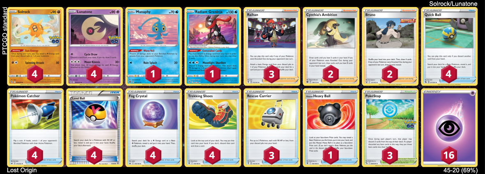
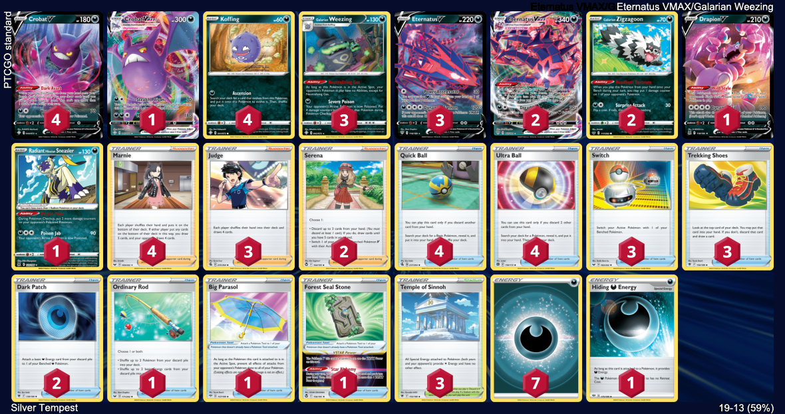

# Standard: D-on

I can't say too much about how good this format was since I just started playing. It was disheartening to see Lugia take top spots at some regionals, but so good to see diverse metagames in others. Coming from other TCGs, seeing such variety in decks filled me with hope that this game could be the best TCG on the market, and I haven't been disappointed since.

* [LOR: Lunatone/Solrock](#lunatonesolrock-the-first-one)
* [SIT: Eternatus/Weezing](#eternatusgalarian-weezing-pure-evil)
* [SIT: Regis](#regis-crushing-power)
* [CRZ: LZB/Amazing Rares](#lost-zone-box-with-amazing-rares-skill-diff)

# Lunatone/Solrock: The First One

This was my first competitive-ish deck ever. Cheap to build and powerful enough to oneshot even VMaxes — what's more to love? The fact that you can win against players with better decks, but worse skill. I made up plans on the fly, built prize maps, learned sequencing, and capitalized on opponent's mistakes. This was in great contrast to all the other tcgs I've played. So this deck holds a special place in my heart — not the most fun in the grand scheme of things, but probably the most important one.

[top](#standard-d-on)

# Eternatus/Galarian Weezing: Pure Evil

This deck is probably my favorite from whole D-on era. It showed me another aspect of this game that I deeply love: making opponent cry. Galarian Weezing is a stupid card, but just stupid enough to be fun to play both with and against. And while you're slowly melting away opponent's hopes and dreams, you get enough time to build your board and string Dread Ends for massive damage. Very cool.

[top](#standard-d-on)

# Regis: Crushing Power

This is, in a sense, is a more competitive version of Solrock - trade one prize for multiple, with two exceptions. Firstly, you can't be oneshot by other single prizers, and secondly, you're trading blows with opponents in a far more varied and diverse way. When you're of equal skill with your opponent, it feels like games come down to the wire; every decision matters, and there are so many of them. I'm sad to see those guys gone.

[top](#standard-d-on)

# Lost Zone Box with Amazing Rares: Skill Diff

[top](#standard-d-on)
