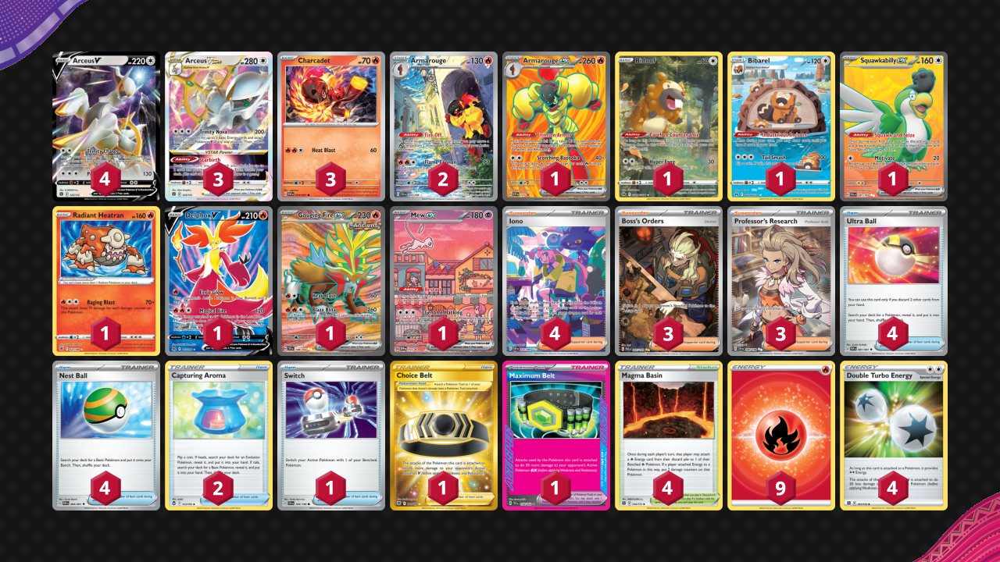
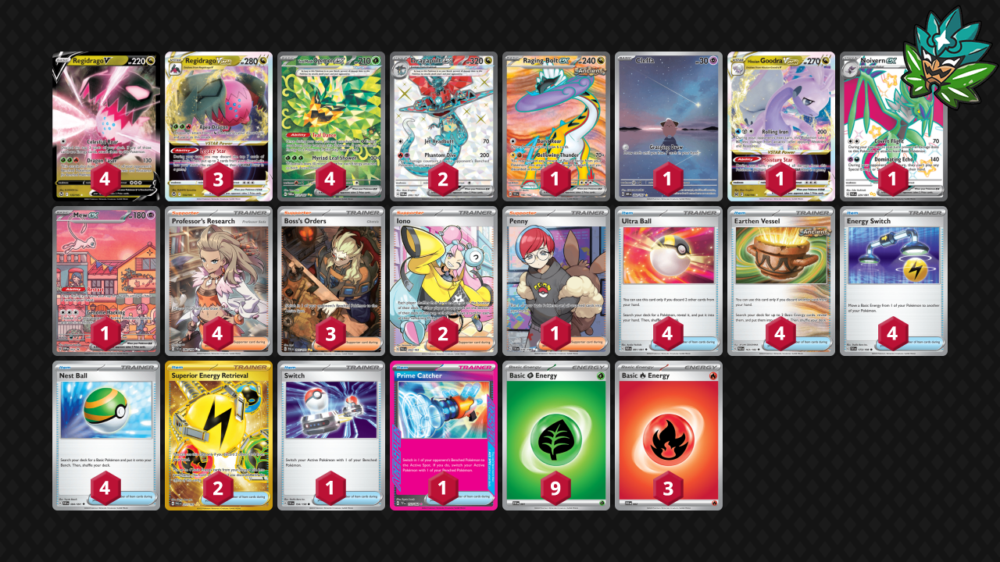
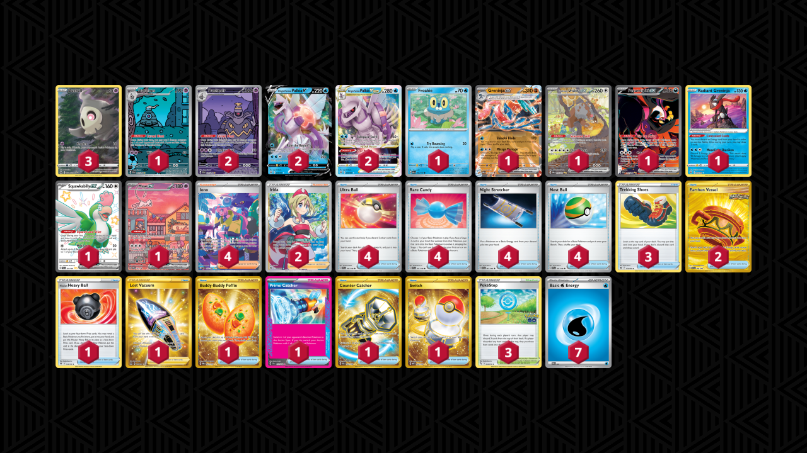
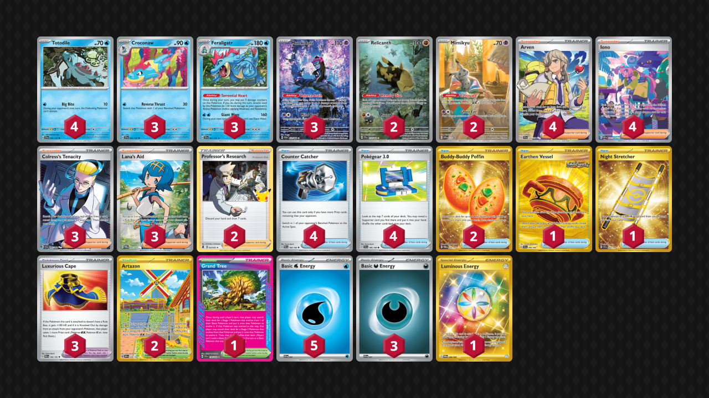

# Standard: F-on

This format was defined by prize manipulation—you've got *Iron Hands ex*, *Cursed Blast Dusknoir*, *Briar*, and *Overvolt Discharge Magneton*—while games did have a lot of decisions, they were heavily accelerated, especially during ***Shrouded Fable*** meta, by far the worst one I've played. However, *Itchy Pollen Budew* arrived to save the meta from Dusknoir blowouts, so I'm optimistic about the future.

* [TEF: Arceus/Armarouge](#arceusarmarouge-trading-blows)
* [TWM: Regidrago/Ogerpon](#regidragoogerpon-finally-playable)
* [SRC: Palkia/Dusknoir](#palkiadusknoir-speed-demon)
* [SSP: Gardevoir ex](#gardevoir-ex-pure-skill)
* [PRE: Giant Wave Feraligatr](#giant-wave-feraligatr-well-designed-delight)

## [Arceus/Armarouge](https://github.com/RituLiot/ptcg-decks/blob/main/Standard/10BRS-TEF/Arceus-Armarouge.md): Trading Blows

This deck presses a lot of buttons for me—it's a toolbox, it promotes two hit-kos from both sides, it pairs together completely unrelated Pokemon, and it utilizes different Pokemon from the same evolution line. You've got the goated *Arceus VSTAR* start that pivots into extra prizes with *Delphox V* or *Iron Hands ex*, and in the end, you deliver a finishing OHKO blow with *Armarouge ex*. Chef's kiss.

## [Regidrago/Ogerpon](https://github.com/RituLiot/ptcg-decks/blob/main/Standard/11BRS-TWM/Regidrago-Ogerpon.md): Finally Playable

I believe *Trifrost Kyurem*'s release was a mistake that moved *Regidrago VSTAR* into the broken status it was known for in ***SFA*** meta, hence why I'm including this version instead. And this version is so cool! *Regidrago* is a banger of a design that promotes unique deckbuilding decisions, similar to *Phantom Transformation Zoroark* from before. And energy acceleration from *Teal Mask Ogerpon ex* is such a fair and fun way to make this deck function. I'm honestly enamored by what this deck is and how it came to be. This is good game design.

## [Palkia/Dusknoir](https://github.com/RituLiot/ptcg-decks/blob/main/Standard/13BRS-SRC/Palkia-Dusknoir.md): Speed Demon

One of the fastest decks ever. 2 *Cursed Blast Dusknoirs*, *Palkia VSTAR* into *Radiant Greninja*—you're 4 evolving basics down; your turn. This deck is insane; it breaks the rules of the game, but it feels awesome wielding this amount of power—and yet still losing to *Unfair Stamp* into *Charizard ex*. Should've been slower, buddy. As much as I hate this deck, I also love it wholeheartedly. Glass cannon incarnate.

## [Gardevoir ex](https://github.com/RituLiot/ptcg-decks/blob/main/Standard/14BRS-SSP/Gardevoir%20ex.md): Pure Skill

This is my favorite archetype of the format. It's skill expressive, it's diverse in gameplay, and it's fun. It can also be played in a myriad of different ways—6 different playable Ace Specs (*Brilliant Blender* with 4 *Klefki*s is hillarious) is a statement to this archetype's flexibility in deckbuilding. It feels very rewarding to play, it's very powerful—and it will be sorely missed by me. Hopefully rotation doesn't kill this deck on the spot.

## [Giant Wave Feraligatr](https://github.com/RituLiot/ptcg-decks/blob/main/Standard/15BRS-PRE/Feraligatr.md): Well Designed Delight

This is how you design an evolution line, Jesus! All three—*Totodile*, *Croconaw*, and *Feraligatr*—have their uses, and *Torrential Heart* pairs wonderfully with *Munkidori's Adrena-Brain*. While not the most intricate of decks, it brings hope to see a single prize control deck do so well in so many matchups. More of this, please!
