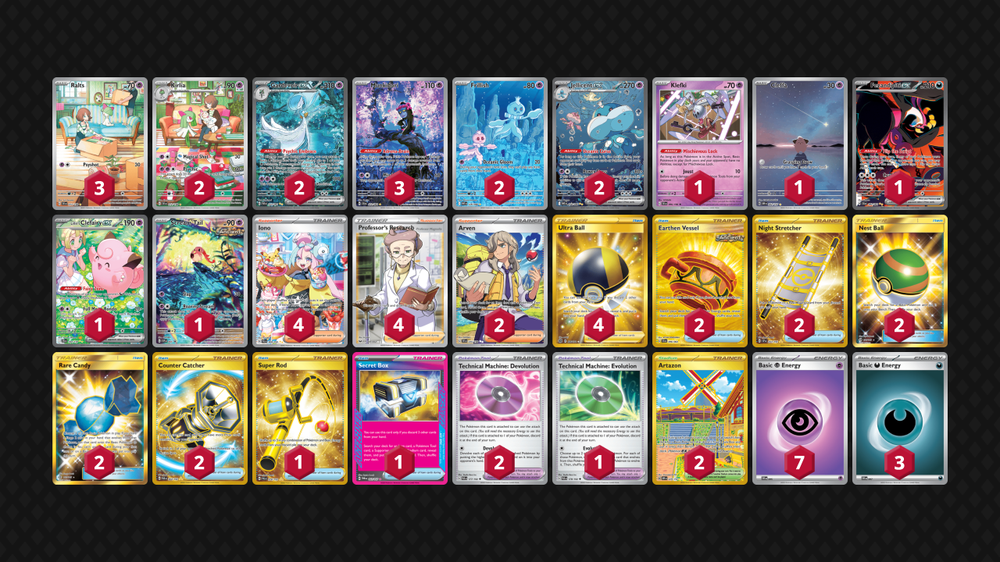

# Standard: G-on

This rotation was disappointing. Trainer's Pokemon were a failure of a mechanic and brought viable 1.5 decks to the table - and other ones, while semi-fun to play, were not deep or well designed due to a simple lack of cards when half of them were pack fillers already. I tried hard to use *Arven's Mabostiff ex*, *Misty's Gyarados*, *Iono's Bellibolt ex*, and literally every trainer, but to no avail. Mega Pokemon could be interesting, and there are some good designs, but they only brought one good deck to meta - Mega Absol box. Overall, I-block cards were powercrept by G-block cards, and the meta was ruled by the Big Four - *Gardevoir ex*, *Charizard ex*, *Gholdengo ex*, and *Dragapult ex* - it got very tiresome to see them over, and over, and over again. Unfortunately, upcoming cards don't seem to be very powerful as well...

* [DRI: Steven's Metagross/Lillie's Clefairy](#stevensmetagross-lillies-clefairy-inconsistent-variety)
* [BBWF: Gardevoir/Jellicent](#gardevoir-jellicent-stall-and-destroy)
* [ASC: Mega Meganium/Ogerpon](#mega-meganium-ogerpon-soothing-beatstick)

## [Steven's Metagross/Lillie's Clefairy](https://github.com/RituLiot/ptcg-decks/blob/main/Standard/17SVI-DRI/Steven's%20Metagross-Lillie's%20Clefairy.md): Inconsistent Variety

I thought this deck was tournament worthy - up until I tried to use it in an actual tournament and got my ass beat. This deck is very inconsistent, and I don't think a more refined build would solve this issue, but it's fun to play nonetheless. If you highroll, you could beat any meta deck with either *Lillie's Clefairy ex*'s ability, hitting stuff for grass weakness with *Teal Mask Ogerpon ex*, or tanking hits with *Steven's Metagross ex*. *Lillie's Pearl* is the best card in the deck in the right conditions.

## [Gardevoir/Jellicent](https://github.com/RituLiot/ptcg-decks/blob/main/Standard/18SVI-BBWF/Gardevoir-Jellicent.md): Stall and Destroy

Now this is my type of deck! You annoy the hell out of your opponent with *Jellicent ex*, then unleash a barrage of different toolbox attacks powered by *Gardevoir ex*. It was novel at the time, giving a completely new look on an existing archetype, with a different speed of play and brand-new decisions of when to stop stalling and start destroying!

## [Mega Meganium-Ogerpon](https://github.com/RituLiot/ptcg-decks/blob/main/Standard/21SVI-ASC/Mega%20Meganium-Ogerpon.md): Soothing Beatstick

This deck is like chicken soup - it's down to the ground, very simple for consumption, yet provides some satisfying moments and interesting decisions. *Wellspring Mask Ogerpon ex* is the card that elevates this deck from an unoriginal beatstick-engine model to something I could see myself enjoying later down the lane.
