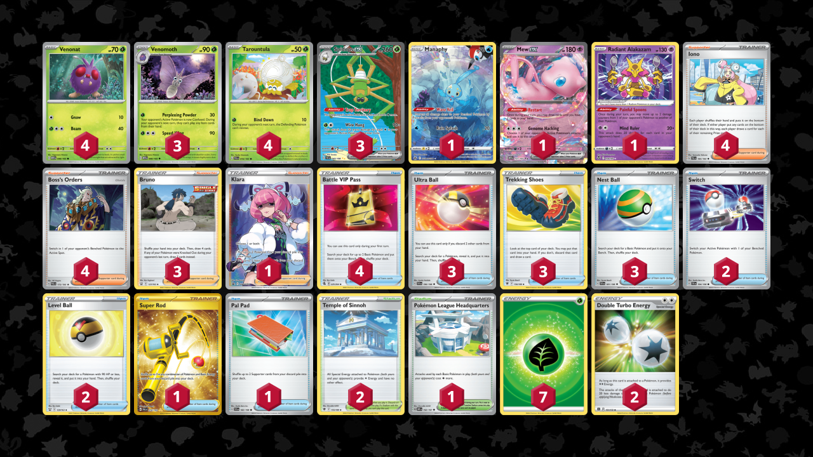

# Spidops/Venomoth

> **Author**: Jake Ewart
> 
> **Competitiveness:** C | **Difficulty:** Medium | **Fun:** A-

## List
* 1 Manaphy CRZ-GG 6
* 3 Venomoth MEW 49
* 1 Mew ex MEW 151
* 4 Venonat MEW 48
* 4 Tarountula PAL 16
* 3 Spidops ex SVI 243
* 1 Radiant Alakazam SIT 59
* 1 Klara PR-SW 302
* 3 Ultra Ball SVI 196
* 2 Switch SVI 194
* 3 Bruno BST 121
* 2 Level Ball BST 129
* 3 Trekking Shoes ASR 156
* 1 Super Rod PAL 276
* 4 Battle VIP Pass FST 225
* 4 Iono PAL 185
* 1 Pokémon League Headquarters OBF 192
* 1 Pal Pad SVI 182
* 2 Temple of Sinnoh ASR 155
* 3 Nest Ball SVI 181
* 4 Boss's Orders PAL 172
* 7 Basic {G} Energy SVE 1
* 2 Double Turbo Energy BRS 151
