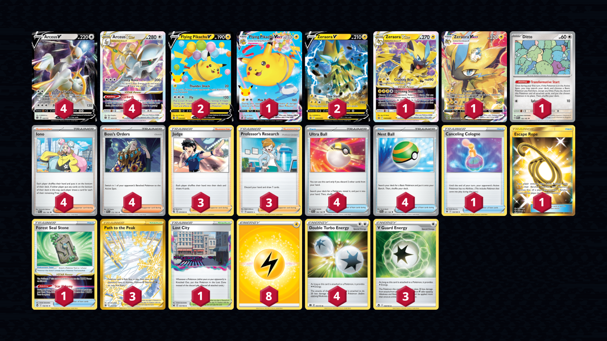

# Arceus/Zeraora

> **Source**: Ryohei Miyamoto, [5th Place Champions League Kyoto](https://limitlesstcg.com/decks/list/9622)
> 
> **Competitiveness:** C+ | **Difficulty:** Moderate | **Fun:** A-

## List
* 4 Arceus VSTAR BRS 123
* 4 Arceus V BRS 122
* 1 Flying Pikachu VMAX CEL 7
* 2 Flying Pikachu V CEL 6
* 1 Zeraora VSTAR PR-SW 265
* 2 Zeraora V PR-SW 263
* 1 Ditto MEW 132
* 1 Zeraora VMAX CRZ-GG 42
* 4 Ultra Ball SVI 196
* 3 Judge FST 235
* 1 Canceling Cologne ASR 136
* 3 Path to the Peak ASR 213
* 1 Lost City LOR 161
* 4 Iono PAL 185
* 3 Professor's Research SHF 60
* 1 Escape Rope BUS 163
* 1 Forest Seal Stone SIT 156
* 4 Nest Ball SVI 181
* 4 Boss's Orders PAL 172
* 3 V Guard Energy SIT 169
* 8 Basic {L} Energy SVE 4
* 4 Double Turbo Energy BRS 151
