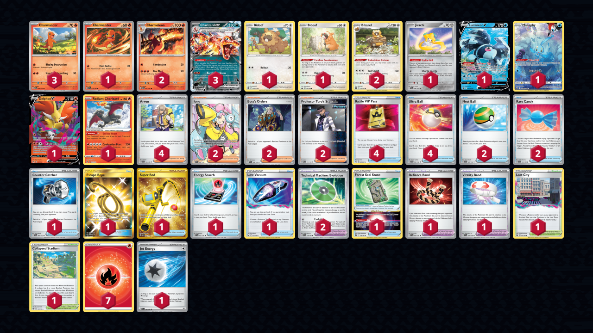
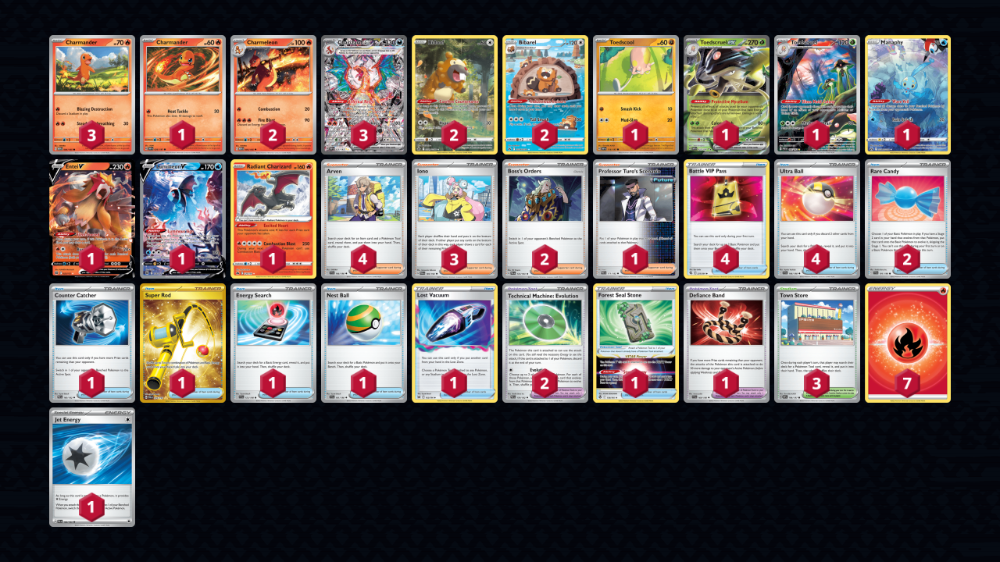

# Charizard/Bibarel

> **Competitiveness:** B+ | **Difficulty:** Hard | **Fun:** A

* [Delphox](#charizardbibareldelphox)
* [Toedscruel](#charizardbibareltoedscruel)

## Charizard/Bibarel/Delphox

> **Source**: Thomas Elliot Jones - [6th Place Regional Gdańsk](https://limitlesstcg.com/decks/list/9214)

[top](#charizardbibarel)

### List
* 3 Charmander MEW 4
* 2 Charmeleon MEW 5
* 1 Jirachi PAR 126
* 1 Lumineon V PR-SW 250
* 1 Manaphy CRZ-GG 6
* 1 Charmander OBF 26
* 1 Delphox V LOR 27
* 2 Bibarel BRS 121
* 1 Bidoof BRS 120
* 1 Radiant Charizard CRZ 20
* 1 Bidoof CRZ 111
* 3 Charizard ex OBF 125
* 1 Counter Catcher PAR 160
* 1 Escape Rope BUS 163
* 2 Iono PAL 254
* 1 Super Rod PAL 276
* 1 Forest Seal Stone SIT 156
* 1 Energy Search SVI 172
* 2 Nest Ball SVI 181
* 1 Lost City LOR 161
* 4 Battle VIP Pass FST 225
* 2 Boss's Orders PAL 172
* 4 Arven SVI 166
* 2 Technical Machine: Evolution PAR 178
* 1 Defiance Band SVI 169
* 2 Professor Turo's Scenario PAR 171
* 1 Lost Vacuum LOR 162
* 1 Collapsed Stadium BRS 137
* 4 Ultra Ball SVI 196
* 1 Vitality Band SVI 197
* 2 Rare Candy SVI 191
* 1 Jet Energy PAL 190
* 7 Basic {R} Energy SVE 2

## Charizard/Bibarel/Toedscruel

> **Source**: OmniPoke - [OmniPoke video](https://www.youtube.com/watch?v=kybpX1-AuMY)

[top](#charizardbibarel)

### List
* 3 Charmander MEW 4
* 2 Charmeleon MEW 5
* 2 Bidoof CRZ-GG 29
* 3 Charizard ex OBF 223
* 1 Manaphy CRZ-GG 6
* 1 Charmander OBF 26
* 1 Toedscool OBF 118
* 1 Entei V BRS 22
* 1 Toedscruel ex OBF 22
* 1 Lumineon V BRS 156
* 1 Radiant Charizard CRZ 20
* 1 Toedscruel PAR 185
* 2 Bibarel CRZ-GG 25
* 1 Counter Catcher PAR 160
* 3 Town Store OBF 196
* 1 Super Rod PAL 276
* 1 Forest Seal Stone SIT 156
* 1 Energy Search SVI 172
* 1 Nest Ball SVI 181
* 4 Battle VIP Pass FST 225
* 2 Boss's Orders PAL 172
* 3 Iono PAL 185
* 4 Arven SVI 166
* 2 Technical Machine: Evolution PAR 178
* 1 Defiance Band SVI 169
* 1 Professor Turo's Scenario PAR 171
* 1 Lost Vacuum LOR 162
* 4 Ultra Ball SVI 196
* 2 Rare Candy SVI 191
* 1 Jet Energy PAL 190
* 7 Basic {R} Energy SVE 2
