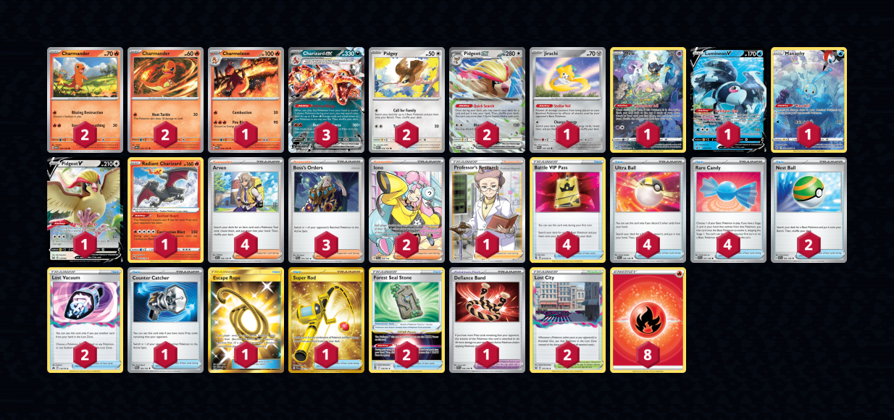

# Charizard/Pidgeot

> **Source**: Erin Kingma - [2nd Place Regional Gdańsk](https://limitlesstcg.com/decks/list/9210)
> 
> **Competitiveness:** A | **Difficulty:** Medium | **Fun:** B+

## List
* 2 Charmander MEW 4
* 1 Charmeleon MEW 5
* 2 Pidgey MEW 16
* 1 Jirachi PAR 126
* 1 Mew CRZ-GG 10
* 1 Lumineon V PR-SW 250
* 1 Manaphy CRZ-GG 6
* 2 Charmander OBF 26
* 1 Pidgeot V LOR 137
* 1 Radiant Charizard CRZ 20
* 2 Pidgeot ex OBF 164
* 3 Charizard ex OBF 125
* 1 Counter Catcher PAR 160
* 1 Escape Rope BUS 163
* 2 Iono PAL 254
* 1 Super Rod PAL 276
* 2 Forest Seal Stone SIT 156
* 2 Nest Ball SVI 181
* 1 Professor's Research SSH 201
* 2 Lost City LOR 161
* 4 Battle VIP Pass FST 225
* 3 Boss's Orders PAL 172
* 4 Arven SVI 166
* 2 Lost Vacuum CRZ 135
* 1 Defiance Band SVI 169
* 4 Ultra Ball SVI 196
* 4 Rare Candy SVI 191
* 8 Basic {R} Energy Energy 37
