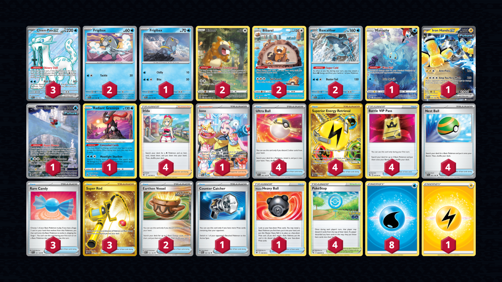

# Chien-Pao/Baxcalibur

> **Source**: Jared Grimes - [Day 2 Regional San Antonio, TX](https://limitlesstcg.com/decks/list/9509)
> 
> **Competitiveness:** B | **Difficulty:** Medium | **Fun:** B+

## List
* 1 Manaphy CRZ-GG 6
* 2 Baxcalibur PAL 60
* 1 Frigibax PAL 58
* 1 Iron Hands ex PAR 70
* 2 Bibarel CRZ-GG 25
* 1 Iron Bundle PR-SV 66
* 1 Radiant Greninja ASR 46
* 2 Frigibax PAL 57
* 3 Chien-Pao ex PAL 236
* 2 Bidoof CRZ-GG 29
* 4 Ultra Ball SVI 196
* 4 Irida ASR 147
* 3 Rare Candy SVI 191
* 2 Earthen Vessel PAR 163
* 1 Counter Catcher PAR 160
* 1 Hisuian Heavy Ball ASR 146
* 3 Super Rod PAL 276
* 4 Superior Energy Retrieval PAL 277
* 4 Battle VIP Pass FST 225
* 1 Iono PAL 269
* 4 PokéStop PGO 68
* 4 Nest Ball SVI 181
* 1 Basic {L} Energy Energy 48
* 8 Basic {W} Energy SVE 3
