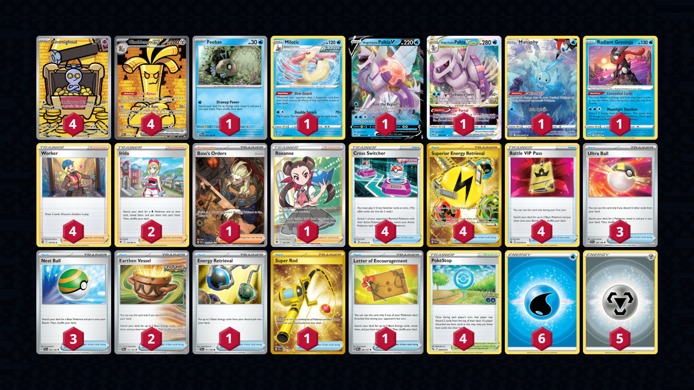

# Gholdengo/Palkia

> **Source**: Kazuki Takahashi - [3rd Place Champions League Kyoto](https://limitlesstcg.com/decks/list/9620)
> 
> **Competitiveness:** B- | **Difficulty:** Medium | **Fun:** A-

## List
* 1 Manaphy CRZ-GG 6
* 1 Milotic EVS 38
* 1 Feebas PAR 35
* 4 Gholdengo ex PAR 252
* 4 Gimmighoul PAR 198
* 1 Origin Forme Palkia V ASR 39
* 1 Origin Forme Palkia VSTAR ASR 40
* 1 Radiant Greninja ASR 46
* 3 Ultra Ball SVI 196
* 2 Irida ASR 147
* 1 Boss's Orders PAL 265
* 4 Cross Switcher FST 230
* 2 Earthen Vessel PAR 163
* 1 Energy Retrieval SVI 171
* 4 Worker SIT 167
* 1 Super Rod PAL 276
* 4 Superior Energy Retrieval PAL 277
* 4 Battle VIP Pass FST 225
* 1 Letter of Encouragement OBF 189
* 4 PokéStop PGO 68
* 1 Roxanne ASR 188
* 3 Nest Ball SVI 181
* 6 Basic {W} Energy SVE 3
* 5 Basic {M} Energy Energy 16
