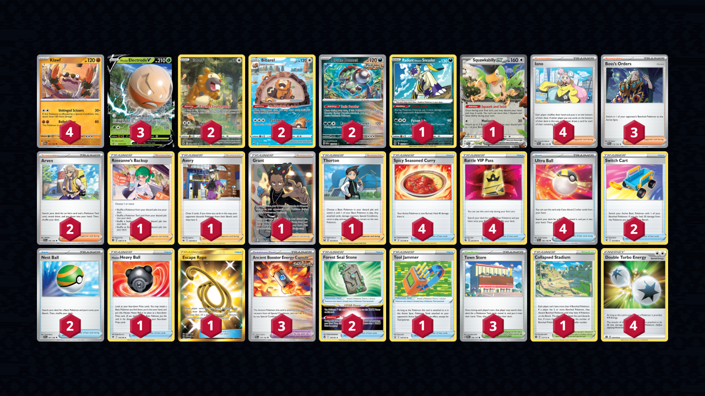

# Klawf/Electrode

> **Source**: Ian Fukuda - N/A
> 
> **Competitiveness:** B- | **Difficulty:** Moderate | **Fun:** A

## List
* 2 Bidoof CRZ-GG 29
* 2 Brute Bonnet PAR 123
* 4 Klawf PAR 105
* 1 Radiant Hisuian Sneasler LOR 123
* 3 Hisuian Electrode V PR-SW 294
* 2 Bibarel CRZ-GG 25
* 1 Squawkabilly ex PAL 169
* 1 Hisuian Heavy Ball ASR 146
* 2 Switch Cart ASR 154
* 1 Escape Rope BUS 163
* 3 Town Store OBF 196
* 1 Roseanne's Backup BRS 148
* 2 Forest Seal Stone SIT 156
* 1 Avery CRE 130
* 4 Spicy Seasoned Curry ASR 151
* 1 Grant ASR 185
* 2 Nest Ball SVI 181
* 1 Thorton LOR 167
* 1 Tool Jammer BST 136
* 3 Ancient Booster Energy Capsule PAR 159
* 4 Battle VIP Pass FST 225
* 3 Boss's Orders PAL 172
* 4 Iono PAL 185
* 2 Arven SVI 166
* 1 Collapsed Stadium BRS 137
* 4 Ultra Ball SVI 196
* 4 Double Turbo Energy BRS 151
