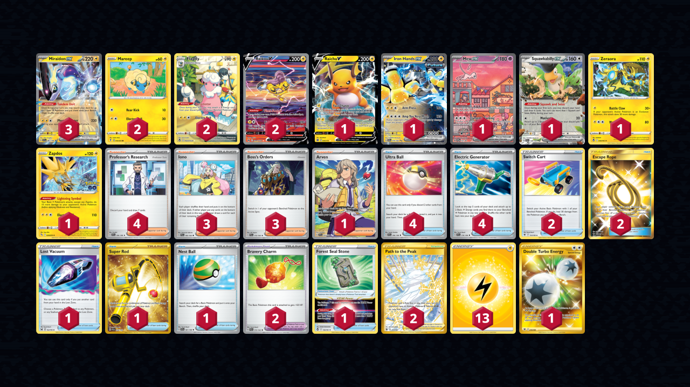

# Miraidon/Flaaffy

> **Source**: Juho Kallama - [1st Place LAIC 2023–24, São Paulo](https://limitlesstcg.com/decks/list/9084)
> 
> **Competitiveness:** A | **Difficulty:** Medium | **Fun:** A-

## List
* 2 Raikou V CRZ-GG 41
* 2 Flaaffy SIT-TG 3
* 1 Raichu V BRS 45
* 3 Miraidon ex SVI 81
* 1 Iron Hands ex PAR 70
* 2 Mareep EVS 54
* 1 Mew ex PR-SV 53
* 1 Squawkabilly ex PAL 169
* 1 Zeraora SIT 56
* 1 Zapdos PGO 29
* 4 Ultra Ball SVI 196
* 1 Arven SVI 235
* 2 Switch Cart ASR 154
* 4 Professor's Research SVI 190
* 4 Electric Generator SVI 170
* 2 Path to the Peak ASR 213
* 1 Lost Vacuum LOR 162
* 1 Super Rod PAL 276
* 3 Iono PAL 185
* 2 Escape Rope BUS 163
* 1 Forest Seal Stone SIT 156
* 1 Nest Ball SVI 181
* 2 Bravery Charm PAL 173
* 3 Boss's Orders PAL 172
* 1 Double Turbo Energy ASR 216
* 13 Basic {L} Energy SVE 4
