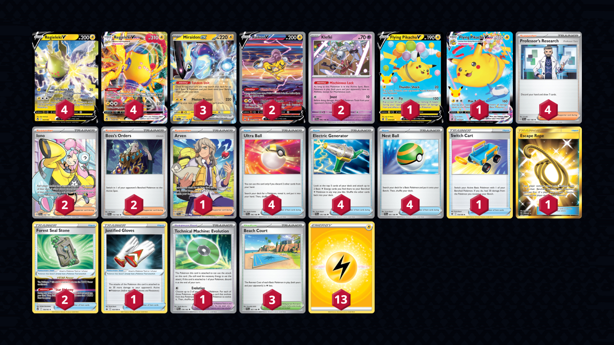

# Miraidon/Regieleki

> **Source**: yushinron63 - N/A
> 
> **Competitiveness:** D+ | **Difficulty:** Moderate | **Fun:** A-

## List
* 2 Raikou V CRZ-GG 41
* 2 Klefki SVI 96
* 3 Miraidon ex SVI 81
* 1 Flying Pikachu VMAX CEL 7
* 1 Flying Pikachu V CEL 6
* 4 Regieleki VMAX SIT 58
* 4 Regieleki V SIT 57
* 4 Ultra Ball SVI 196
* 1 Arven SVI 235
* 1 Switch Cart ASR 154
* 4 Professor's Research SVI 190
* 4 Electric Generator SVI 170
* 1 Justified Gloves CRE 143
* 1 Technical Machine: Evolution PAR 178
* 1 Escape Rope BUS 163
* 2 Forest Seal Stone SIT 156
* 2 Iono PAL 254
* 4 Nest Ball SVI 181
* 2 Boss's Orders PAL 172
* 3 Beach Court SVI 167
* 13 Basic {L} Energy SVE 4
