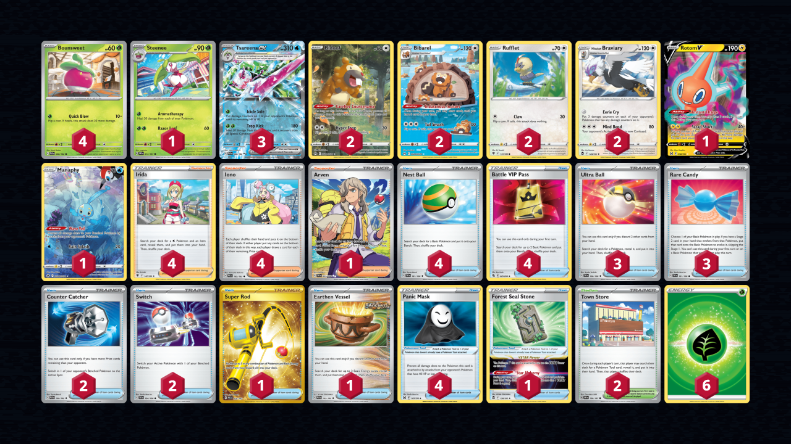

# Tsareena/Braviary

> **Source**: key - [Top 4 トイコンプ岸和田店 (Osaka)](https://www.pokemon-card.com/deck/confirm.html/deckID/xY8Jc8-UgYLlK-DDcxca)
> 
> **Competitiveness:** C- | **Difficulty:** Medium | **Fun:** A

## List
* 1 Steenee OBF 17
* 2 Bidoof CRZ-GG 29
* 1 Rotom V LOR 58
* 3 Tsareena ex PAR 46
* 2 Rufflet ASR 131
* 1 Manaphy CRZ-GG 6
* 4 Bounsweet PAR 8
* 2 Bibarel CRZ-GG 25
* 2 Hisuian Braviary SIT 149
* 2 Counter Catcher PAR 160
* 2 Town Store OBF 196
* 1 Super Rod PAL 276
* 1 Forest Seal Stone SIT 156
* 4 Irida ASR 147
* 4 Nest Ball SVI 181
* 4 Battle VIP Pass FST 225
* 4 Iono PAL 185
* 4 Panic Mask LOR 165
* 1 Earthen Vessel PAR 163
* 1 Arven SVI 235
* 3 Ultra Ball SVI 196
* 2 Switch SVI 194
* 3 Rare Candy SVI 191
* 6 Basic {G} Energy SVE 1
