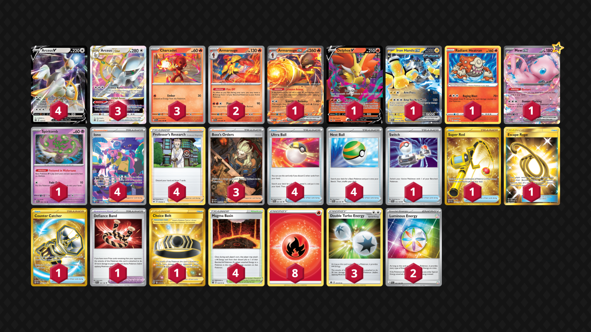

# Arceus/Armarouge

> **Source**: Renaud Levain - [Top 64 Regional Dortmund](https://limitlesstcg.com/decks/list/10247)
> 
> **Competitiveness:** B- | **Difficulty:** Medium | **Fun:** B-

## List
* 3 Charcadet SVI 39
* 3 Arceus VSTAR BRS 123
* 4 Arceus V BRS 122
* 1 Delphox V LOR 27
* 1 Iron Hands ex PAR 70
* 1 Radiant Heatran ASR 27
* 2 Armarouge PAF 15
* 1 Mew ex MEW 151
* 1 Armarouge ex PAR 27
* 1 Spiritomb PAL 89
* 1 Switch SVI 194
* 4 Ultra Ball PAF 91
* 3 Boss's Orders PAL 265
* 1 Defiance Band SVI 169
* 1 Super Rod PAL 276
* 4 Iono PAF 237
* 4 Professor's Research SSH 178
* 1 Choice Belt ASR 211
* 1 Escape Rope BUS 163
* 1 Counter Catcher PAR 264
* 4 Nest Ball PAF 84
* 4 Magma Basin BRS 144
* 3 Double Turbo Energy BRS 151
* 8 Basic {R} Energy Energy 46
* 2 Luminous Energy PAL 191
