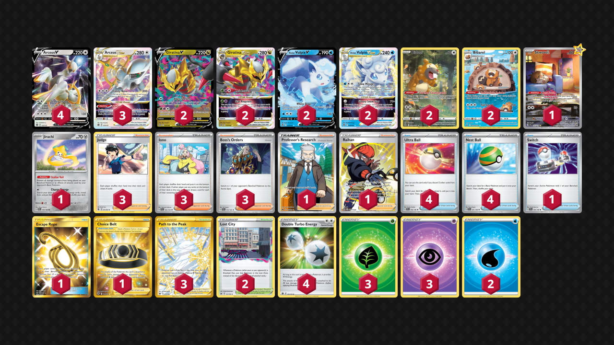

# Arceus/Giratina/Vulpix

> **Source**: じぞう - PokecaBook
> 
> **Competitiveness:** C | **Difficulty:** Moderate | **Fun:** B+

## List
* 1 Skwovet SVI 222
* 2 Giratina V LOR 130
* 3 Arceus VSTAR BRS 123
* 2 Alolan Vulpix V SIT 33
* 4 Arceus V BRS 122
* 2 Giratina VSTAR LOR 131
* 2 Alolan Vulpix VSTAR SIT 34
* 2 Bibarel CRZ-GG 25
* 1 Jirachi PAR 126
* 2 Bidoof CRZ-GG 29
* 4 Ultra Ball SVI 196
* 1 Switch SVI 194
* 3 Judge FST 235
* 3 Path to the Peak ASR 213
* 2 Lost City LOR 161
* 3 Iono PAL 185
* 1 Professor's Research CRZ 150
* 1 Choice Belt ASR 211
* 1 Escape Rope BUS 163
* 4 Nest Ball SVI 181
* 1 Raihan SIT-TG 27
* 3 Boss's Orders PAL 172
* 3 Basic {G} Energy SVE 1
* 2 Basic {W} Energy SVE 3
* 3 Basic {P} Energy SVE 5
* 4 Double Turbo Energy BRS 151
