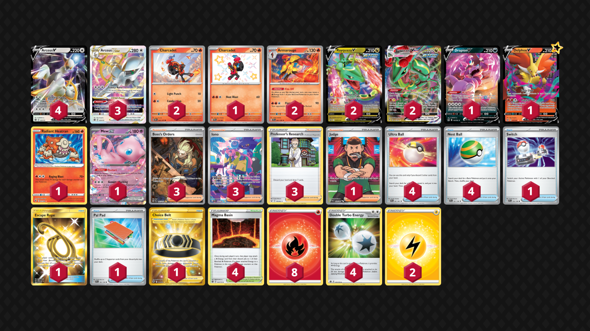

# Arceus/Rayquaza

> **Source**: Liam Burden - [Top 32 Regional Liverpool](https://limitlesstcg.com/decks/list/9974)
> 
> **Competitiveness:** B | **Difficulty:** Medium | **Fun:** A-

## List
* 2 Armarouge SVI 41
* 1 Charcadet PAF 114
* 1 Drapion V LOR 118
* 3 Arceus VSTAR BRS 123
* 4 Arceus V BRS 122
* 1 Delphox V LOR 27
* 1 Radiant Heatran ASR 27
* 2 Rayquaza V PR-SW 147
* 1 Mew ex MEW 151
* 2 Rayquaza VMAX EVS 111
* 2 Charcadet OBF 43
* 1 Switch SVI 194
* 4 Ultra Ball PAF 91
* 3 Boss's Orders PAL 265
* 3 Iono PAF 237
* 3 Professor's Research SSH 178
* 1 Choice Belt ASR 211
* 1 Escape Rope BUS 163
* 1 Pal Pad SVI 182
* 4 Nest Ball SVI 181
* 1 Judge PAF 228
* 4 Magma Basin BRS 144
* 2 Basic {L} Energy Energy 48 
* 8 Basic {R} Energy SVE 2
* 4 Double Turbo Energy BRS 151
