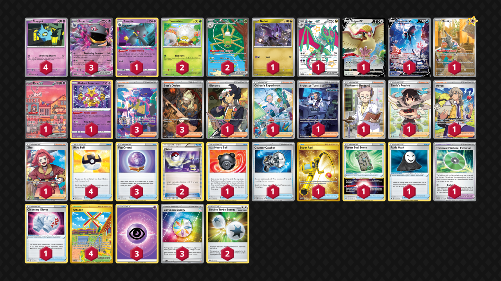

# Banette/Spidops

> **Source**: 窓 - [Top 4 宝島　可児店岐阜](https://players.pokemon-card.com/event/detail/262841/result)
> 
> **Competitiveness:** D | **Difficulty:** Hard | **Fun:** A

## List
* 1 Banette LOR 73
* 1 Noivern ex PAF 220
* 4 Shuppet SVI 87
* 1 Noibat PAL 152
* 1 Pidgeot V LOR 137
* 1 Lumineon V BRS 156
* 2 Tarountula PAL 16
* 3 Banette ex SVI 88
* 2 Spidops ex SVI 243
* 1 Mimikyu PR-SV 75
* 1 Mew ex PR-SV 53
* 1 Radiant Alakazam SIT 59
* 1 Hisuian Heavy Ball ASR 146
* 1 Counter Catcher PAR 160 PH
* 1 Giacomo PAL 252
* 1 Colress's Experiment CRZ-GG 59
* 1 Super Rod PAL 276
* 4 Artazon OBF 229
* 1 Forest Seal Stone SIT 156
* 4 Ultra Ball CRZ 146
* 1 Professor Turo's Scenario PAR 257
* 1 Professor's Research SSH 201
* 3 Iono PAF 237
* 3 Fog Crystal CRE 140
* 3 Boss's Orders PAL 265
* 1 Zinnia's Resolve EVS 203
* 1 Panic Mask LOR 165
* 1 Technical Machine: Evolution PAR 178
* 1 Arven SVI 235
* 2 Switch KSS 38
* 1 Zisu ASR 189
* 1 Cleansing Gloves BRS 136
* 3 Basic {P} Energy SVE 5
* 3 Luminous Energy PAL 191
* 2 Double Turbo Energy BRS 151
