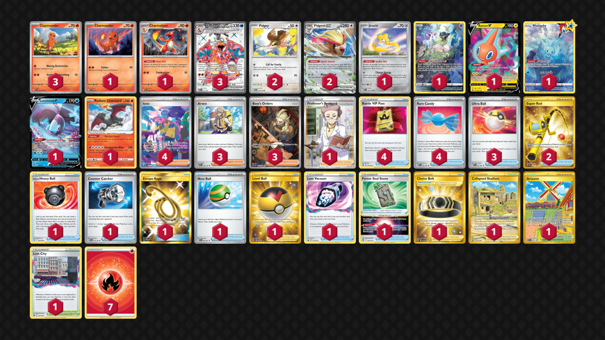

# Charizard/Pidgeot

> **Source**: Rhian Famaran - [1st Place Philippines Regional League Vol.2](https://limitlesstcg.com/decks/list/10332)
> 
> **Competitiveness:** A+ | **Difficulty:** Medium | **Fun:** B

## List
* 2 Pidgey MEW 16
* 3 Charmander PAF 7
* 1 Jirachi PAR 126
* 1 Charmeleon PAF 8
* 1 Mew CRZ-GG 10
* 1 Rotom V CRZ 45
* 1 Manaphy CRZ-GG 6
* 1 Lumineon V BRS 40
* 3 Charizard ex OBF 215
* 1 Radiant Charizard CRZ 20
* 1 Charmander PR-SV 47
* 2 Pidgeot ex OBF 164
* 1 Hisuian Heavy Ball ASR 146
* 1 Collapsed Stadium LOR 215
* 1 Counter Catcher PAR 160
* 1 Escape Rope BUS 163
* 2 Super Rod PAL 276
* 1 Nest Ball PAF 84
* 1 Artazon OBF 229
* 1 Forest Seal Stone SIT 156
* 1 Level Ball BST 181
* 3 Ultra Ball PAF 91
* 1 Choice Belt ASR 211
* 1 Professor's Research SSH 201
* 1 Lost City LOR 161
* 4 Iono PAF 237
* 3 Arven OBF 186
* 4 Battle VIP Pass FST 225
* 3 Boss's Orders PAL 265
* 1 Lost Vacuum CRZ 135
* 4 Rare Candy PAF 89
* 7 Basic {R} Energy SVE 2
