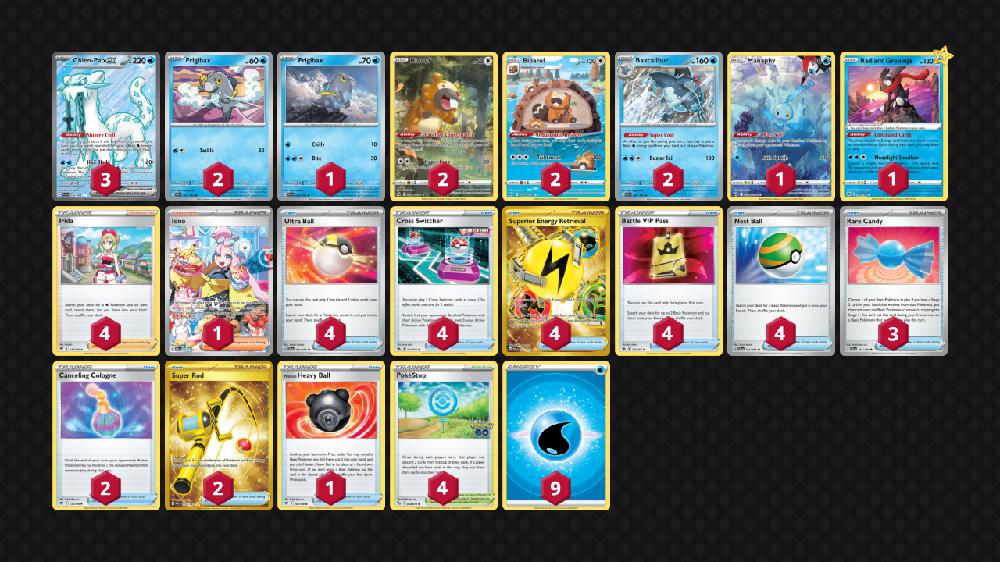
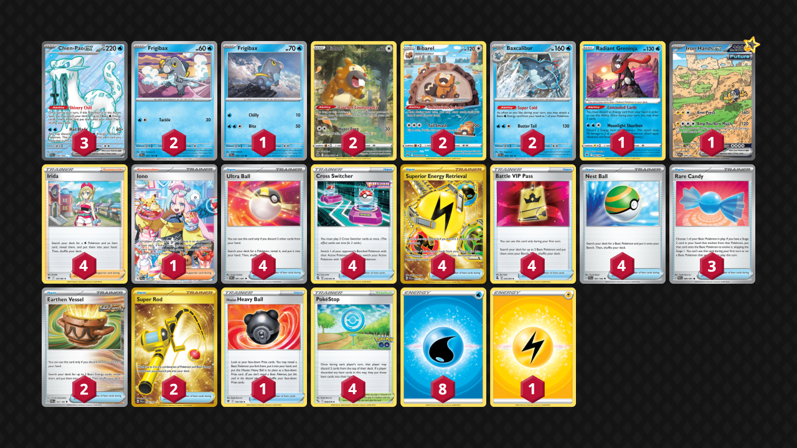

# Chien-Pao/Baxcalibur

> **Competitiveness:** A | **Difficulty:** Hard | **Fun:** A

* [feat. Canceling Cologne](#feat-canceling-cologne)
* [feat. Iron Hands ex](#feat-iron-hands-ex)

## feat. Canceling Cologne

> **Source**: Jared Grimes - [Top 32 Regional Portland, OR](https://limitlesstcg.com/decks/list/9655)

[top](#chien-paobaxcalibur)

### List
* 1 Manaphy CRZ-GG 6
* 2 Baxcalibur PAL 60
* 1 Frigibax PAL 58
* 2 Bibarel CRZ-GG 25
* 1 Radiant Greninja ASR 46
* 2 Frigibax PAL 57
* 3 Chien-Pao ex PAL 236
* 2 Bidoof CRZ-GG 29
* 4 Ultra Ball SVI 196
* 4 Irida ASR 147
* 3 Rare Candy SVI 191
* 2 Canceling Cologne ASR 136
* 4 Cross Switcher FST 230
* 1 Hisuian Heavy Ball ASR 146
* 2 Super Rod PAL 276
* 4 Superior Energy Retrieval PAL 277
* 4 Battle VIP Pass FST 225
* 1 Iono PAL 269
* 4 PokéStop PGO 68
* 4 Nest Ball SVI 181
* 9 Basic {W} Energy SVE 3

## feat. Iron Hands ex

> **Source**: Owyn Kamerman - [1st Place Regional Dortmund](https://limitlesstcg.com/decks/list/10215)

[top](#chien-paobaxcalibur)

### List
* 2 Baxcalibur PAL 60
* 1 Frigibax PAL 58
* 2 Bibarel CRZ-GG 25
* 1 Radiant Greninja ASR 46
* 2 Frigibax PAL 57
* 3 Chien-Pao ex PAL 236
* 2 Bidoof CRZ-GG 29
* 1 Iron Hands ex PAR 248
* 3 Rare Candy PAF 89
* 4 Irida ASR 147
* 4 Ultra Ball PAF 91
* 4 Cross Switcher FST 230
* 2 Earthen Vessel PAR 163
* 1 Hisuian Heavy Ball ASR 146
* 2 Super Rod PAL 276
* 4 Superior Energy Retrieval PAL 277
* 4 Battle VIP Pass FST 225
* 1 Iono PAL 269
* 4 PokéStop PGO 68
* 4 Nest Ball SVI 181
* 1 Basic {L} Energy Energy 48
* 8 Basic {W} Energy Energy 47
