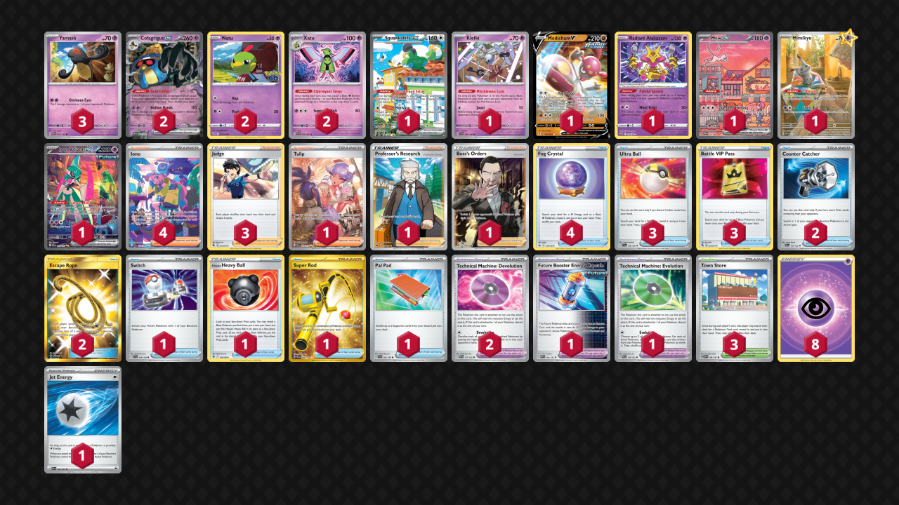

# Cofagrigus/Xatu

> **Source**: xxNico - [3rd Place Pokémon Battle Park](https://play.limitlesstcg.com/tournament/657f8b239d9cfe6271ae1b2f/player/xxnico/decklist)
> 
> **Competitiveness:** D+ | **Difficulty:** Moderate | **Fun:** B

## List1 Squawkabilly ex PAL 264
* 1 Klefki SVI 96
* 3 Yamask PAR 75
* 2 Natu PGO 32
* 1 Medicham V EVS 83
* 2 Xatu PAF 26
* 2 Cofagrigus ex PAR 76
* 1 Radiant Alakazam SIT 59
* 1 Mew ex PR-SV 53
* 1 Mimikyu PR-SV 75
* 1 Iron Valiant ex PAR 249
* 3 Ultra Ball SVI 196
* 1 Switch SVI 194
* 3 Judge FST 235
* 2 Counter Catcher PAR 160
* 1 Hisuian Heavy Ball ASR 146
* 1 Super Rod PAL 276
* 4 Iono PAF 237
* 3 Battle VIP Pass FST 225
* 4 Fog Crystal CRE 140
* 1 Tulip PAR 259
* 2 Technical Machine: Devolution PAR 177
* 1 Future Booster Energy Capsule PAR 164 
* 1 Technical Machine: Evolution PAR 178
* 1 Professor's Research CRZ 150
* 3 Town Store OBF 196
* 2 Escape Rope BUS 163
* 1 Pal Pad SVI 182
* 1 Boss's Orders RCL 189
* 8 Basic {P} Energy SVE 5
* 1 Jet Energy PAL 190
