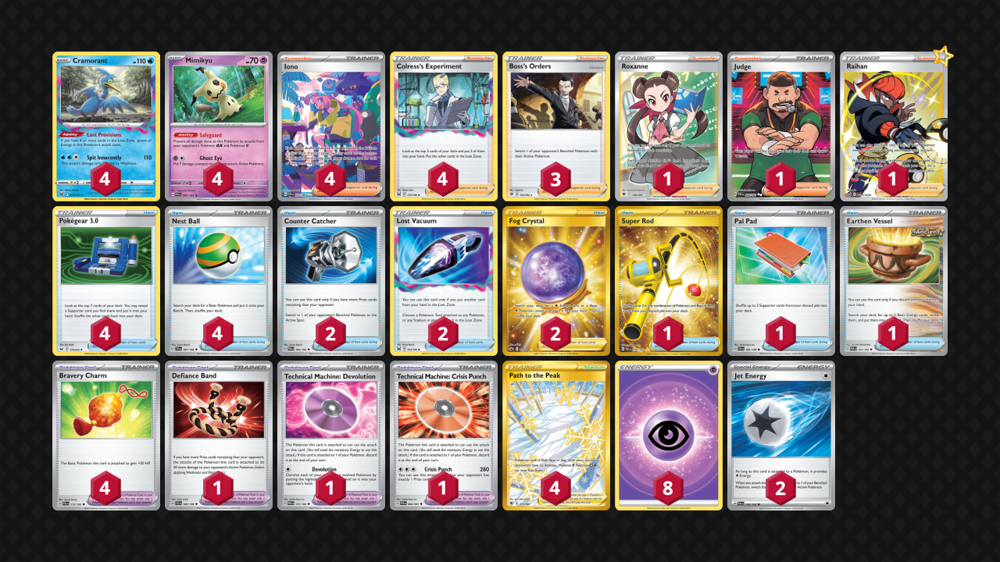

# Cramorant/Mimikyu

> **Source**: たつぼー - PokecaBook
> 
> **Competitiveness:** D+ | **Difficulty:** Medium | **Fun:** A

## List
* 4 Cramorant LOR 50
* 4 Mimikyu PAL 97
* 1 Defiance Band SVI 169
* 4 Path to the Peak ASR 213
* 2 Counter Catcher PAR 160
* 2 Lost Vacuum LOR 162
* 1 Super Rod PAL 276
* 4 Iono PAF 237
* 4 Pokégear 3.0 SSH 174
* 1 Technical Machine: Devolution PAR 177
* 1 Roxanne ASR 188
* 1 Technical Machine: Crisis Punch PAF 90
* 1 Pal Pad SVI 182
* 4 Nest Ball SVI 181
* 4 Colress's Experiment LOR 155
* 3 Boss's Orders RCL 154
* 1 Judge PAF 228
* 1 Raihan SIT-TG 27
* 2 Fog Crystal CRE 227
* 1 Earthen Vessel PAR 163
* 4 Bravery Charm PAL 173
* 8 Basic {P} Energy SVE 5
* 2 Jet Energy PAL 190
