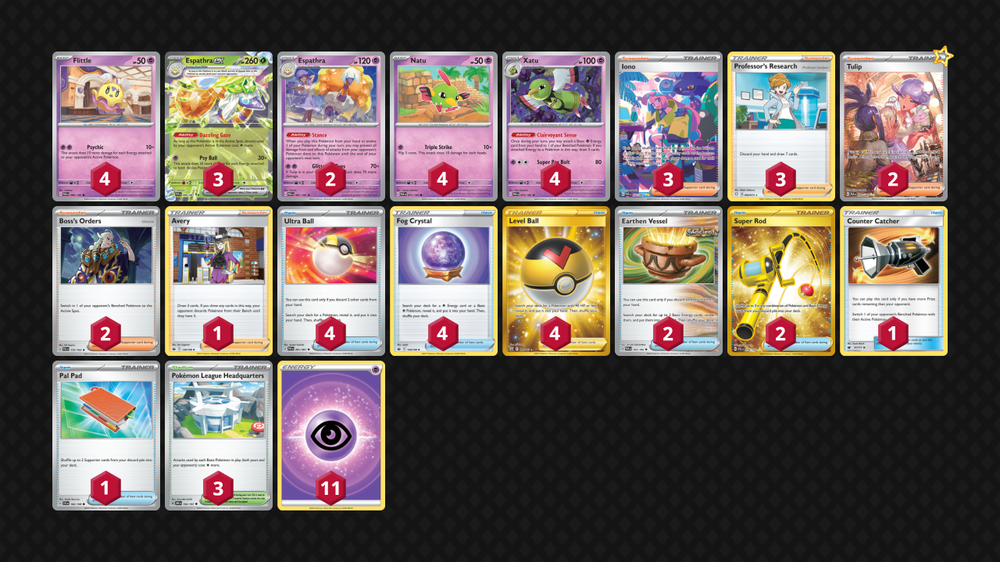

# Espathra/Xatu

> **Source**: PokecaBook
> 
> **Competitiveness:** D+ | **Difficulty:** Moderate | **Fun:** B

## List
* 4 Xatu PAR 72
* 4 Flittle PAR 80
* 3 Espathra ex PAF 6
* 4 Natu PAR 71
* 2 Espathra PAR 81
* 4 Ultra Ball PAF 91
* 2 Earthen Vessel PAR 163
* 1 Avery CRE 130
* 2 Super Rod PAL 276
* 3 Iono PAF 237
* 4 Fog Crystal CRE 140
* 3 Professor's Research SHF 60
* 2 Tulip PAR 259
* 4 Level Ball BST 181
* 1 Counter Catcher CIN 91
* 3 Pokémon League Headquarters OBF 192
* 1 Pal Pad SVI 182
* 2 Boss's Orders PAL 172
* 11 Basic {P} Energy SVE 5
