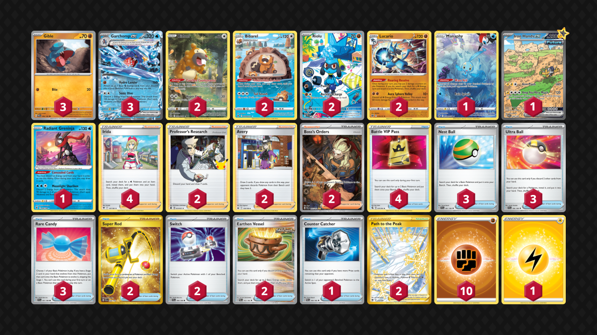

# Garchomp/Lucario

> **Competitiveness:** D | **Difficulty:** Moderate | **Fun:** B-

* [Standard list](#standard-list)
* [feat. Iron Hands ex](#feat-iron-hands-ex)

## Standard list

> **Source**: Eric Smith - [Rare Candy video](https://www.youtube.com/watch?v=LkMVcQiFGJs)

[top](#garchomplucario)

### List
* 2 Bidoof CRZ-GG 29
* 3 Gible PAR 94
* 1 Jirachi PAR 126
* 3 Lucario BRS 79
* 3 Riolu SVI 113
* 1 Manaphy CRZ-GG 6
* 1 Radiant Greninja ASR 46
* 3 Garchomp ex PAR 38
* 2 Bibarel CRZ-GG 25
* 1 Hisuian Heavy Ball ASR 146
* 1 Escape Rope BUS 163
* 2 Boss's Orders SHF 58
* 2 Super Rod PAL 276
* 1 Counter Catcher CIN 91
* 4 Irida ASR 147
* 1 Pal Pad SVI 182
* 4 Nest Ball SVI 181
* 3 Iono PAF 237
* 1 Battle VIP Pass FST 225
* 2 Path to the Peak ASR 213
* 1 Switch KSS 38
* 3 Rare Candy PAF 89
* 4 Ultra Ball SVI 196
* 1 Earthen Vessel PAR 163
* 10 Basic {F} Energy SVE 6

## feat. Iron Hands ex

> **Source**: Dragleik - [Top 64 Late Night 156](https://play.limitlesstcg.com/tournament/652ff1378a7d9977b0c6680a/player/dragleik/decklist)

[top](#garchomplucario)

### List
* 2 Bidoof CRZ-GG 29
* 3 Gible PAR 94
* 2 Lucario BRS 79
* 1 Manaphy CRZ-GG 6
* 2 Riolu SVI 215
* 1 Iron Hands ex PAR 248
* 1 Radiant Greninja ASR 46
* 3 Garchomp ex PAR 38
* 2 Bibarel CRZ-GG 25
* 1 Counter Catcher PAR 160
* 2 Super Rod PAL 276
* 2 Professor's Research CEL 23
* 2 Avery CRE 130
* 4 Irida ASR 147
* 3 Nest Ball SVI 181
* 4 Battle VIP Pass FST 225
* 2 Path to the Peak ASR 213
* 2 Boss's Orders PAL 265
* 3 Ultra Ball SVI 196
* 2 Switch SVI 194
* 3 Rare Candy SVI 191
* 2 Earthen Vessel PAR 163
* 10 Basic {F} Energy SVE 6
* 1 Basic {L} Energy Energy 48
