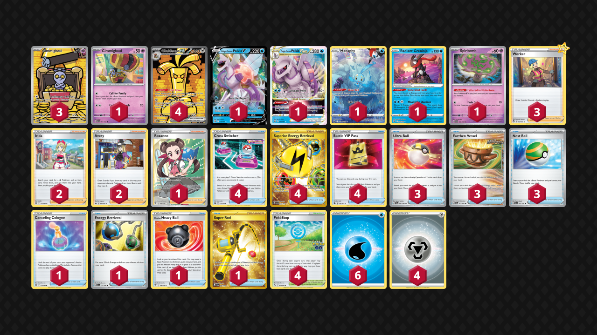

# Gholdengo/Palkia

> **Source**: Jelle van Kampen - [2nd Place Regional Dortmund](https://limitlesstcg.com/decks/list/10216)
> 
> **Competitiveness:** A- | **Difficulty:** Medium | **Fun:** A

## List
* 1 Manaphy CRZ-GG 6
* 4 Gholdengo ex PAR 252
* 3 Gimmighoul PAR 198
* 1 Origin Forme Palkia V ASR 39
* 1 Origin Forme Palkia VSTAR ASR 40
* 1 Radiant Greninja ASR 46
* 1 Spiritomb PAL 89
* 1 Gimmighoul PAR 87
* 2 Irida ASR 147
* 3 Ultra Ball PAF 91
* 1 Canceling Cologne ASR 136
* 4 Cross Switcher FST 230
* 3 Earthen Vessel PAR 163
* 2 Avery CRE 130
* 1 Energy Retrieval SVI 171
* 3 Worker SIT 167
* 1 Hisuian Heavy Ball ASR 146
* 1 Super Rod PAL 276
* 4 Superior Energy Retrieval PAL 277
* 4 Battle VIP Pass FST 225
* 4 PokéStop PGO 68
* 1 Roxanne ASR 188
* 3 Nest Ball SVI 181
* 6 Basic {W} Energy SVE 3
* 4 Basic {M} Energy Energy 8
