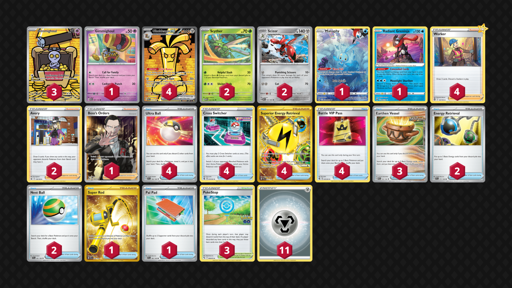

# Gholdengo/Scizor

> **Source**: PokecaBook
> 
> **Competitiveness:** C+ | **Difficulty:** Moderate | **Fun:** A

## List
* 1 Manaphy CRZ-GG 6
* 2 Scyther MEW 123
* 4 Gholdengo ex PAR 252
* 3 Gimmighoul PAR 198
* 2 Scizor OBF 141
* 1 Radiant Greninja ASR 46
* 1 Gimmighoul PAR 87
* 4 Ultra Ball SVI 196
* 4 Cross Switcher FST 230
* 3 Earthen Vessel PAR 163
* 2 Avery CRE 130
* 2 Energy Retrieval SVI 171
* 4 Worker SIT 167
* 1 Super Rod PAL 276
* 4 Superior Energy Retrieval PAL 277
* 4 Battle VIP Pass FST 225
* 3 PokéStop PGO 68
* 1 Pal Pad SVI 182
* 2 Nest Ball SVI 181
* 1 Boss's Orders RCL 189
* 11 Basic {M} Energy Energy 16
