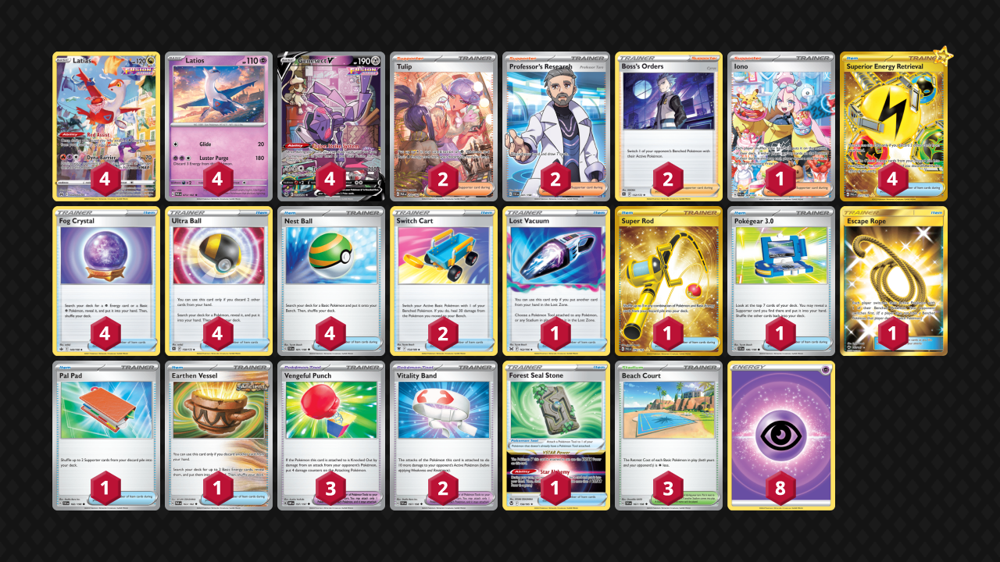

# Latitwins/Genesect

> **Source**: ゆーわ - PokecaBook
> 
> **Competitiveness:** E | **Difficulty:** Moderate | **Fun:** B

## List
* 4 Latias CRZ-GG 20
* 4 Latios PAR 73 PH
* 4 Genesect V FST 255
* 2 Vitality Band SVI 197
* 2 Switch Cart ASR 154
* 1 Lost Vacuum LOR 162
* 1 Super Rod PAL 276
* 4 Superior Energy Retrieval PAL 277
* 4 Fog Crystal CRE 140
* 1 Iono PAL 269
* 2 Tulip PAR 259
* 3 Vengeful Punch OBF 197
* 1 Pokégear 3.0 SVI 186
* 4 Ultra Ball BRS 150
* 2 Professor's Research SVI 241
* 1 Escape Rope BUS 163
* 1 Pal Pad SVI 182
* 1 Forest Seal Stone SIT 156
* 4 Nest Ball SVI 181
* 1 Earthen Vessel PAR 163
* 3 Beach Court SVI 167
* 2 Boss's Orders BRS 132
* 8 Basic {P} Energy SVE 5
