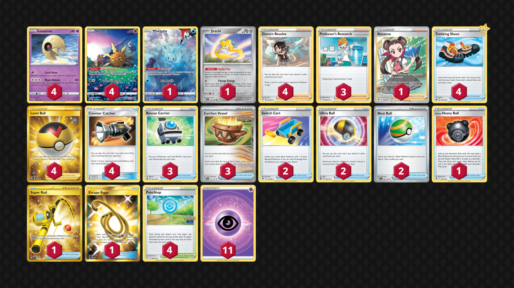

# Lunatone/Solrock

> **Source**: TC Evolutions - Twitter post
> 
> **Competitiveness:** D | **Difficulty:** Easy | **Fun:** C

## List
* 1 Manaphy CRZ-GG 6
* 4 Lunatone CRZ 62
* 4 Solrock CRZ-GG 15
* 1 Jirachi PAR 126
* 2 Switch Cart ASR 154
* 3 Rescue Carrier CRZ 142
* 4 Zinnia's Resolve EVS 164
* 3 Earthen Vessel PAR 163
* 4 Trekking Shoes CRZ 145
* 1 Hisuian Heavy Ball ASR 146
* 1 Super Rod PAL 276
* 3 Professor's Research SHF 60
* 4 PokéStop PGO 68
* 4 Level Ball BST 181
* 4 Counter Catcher CIN 91
* 1 Roxanne ASR 188
* 2 Ultra Ball BRS 150
* 1 Escape Rope BUS 163
* 2 Nest Ball SVI 181
* 11 Basic {P} Energy SVE 5
