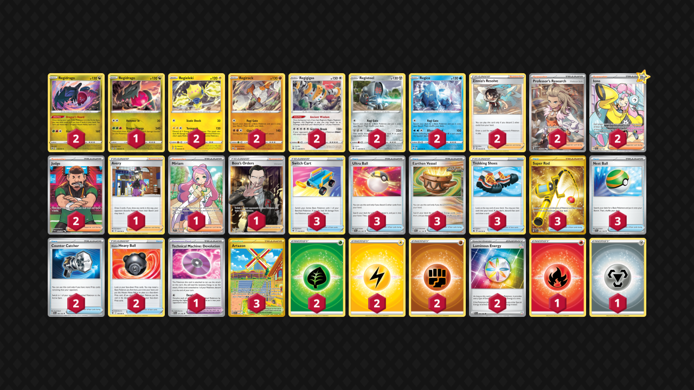

# Regis

> **Source**: Hendrik Christiaan Hasenaar - [Day 2 Regional Dortmund](https://limitlesstcg.com/decks/list/10305)
> 
> **Competitiveness:** B- | **Difficulty:** Moderate | **Fun:** B

## List
* 2 Regieleki EVS 60
* 2 Regirock ASR 75
* 2 Regigigas ASR 130
* 2 Regidrago ASR 118
* 2 Registeel ASR 108
* 1 Regidrago EVS 124
* 2 Regice ASR 37
* 3 Switch Cart ASR 154
* 3 Ultra Ball PAF 91
* 2 Zinnia's Resolve EVS 164
* 3 Earthen Vessel PAR 163
* 1 Avery CRE 130
* 3 Trekking Shoes CRZ 145
* 2 Counter Catcher PAR 160
* 2 Hisuian Heavy Ball ASR 146
* 1 Miriam SVI 238
* 3 Super Rod PAL 276
* 1 Technical Machine: Devolution PAR 177
* 3 Artazon OBF 229
* 2 Professor's Research SVI 240
* 2 Iono PAL 254
* 3 Nest Ball SVI 181
* 2 Judge PAF 228
* 1 Boss's Orders RCL 189
* 1 Basic {R} Energy Energy 2
* 2 Basic {G} Energy Energy 1
* 2 Basic {L} Energy Energy 4
* 2 Basic {F} Energy Energy 6
* 1 Basic {M} Energy Energy 8
* 2 Luminous Energy PAL 191
