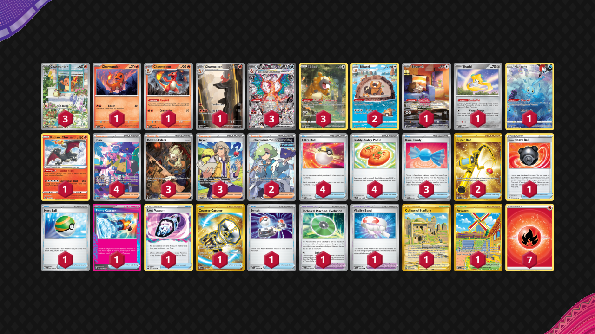

# Charizard/Bibarel

Tier **2** | Difficulty: **Hard** | Gameplan: **Accumulate**

**Source**: Kenta Mori - [4th Place Champions League Fukuoka](https://limitlesstcg.com/decks/list/10318)

## List
* 1 Skwovet SVI 222
* 3 Bidoof CRZ-GG 29
* 3 Charizard ex OBF 223
* 1 Jirachi PAR 126
* 1 Charmeleon PAF 8
* 1 Charmeleon MEW 169
* 1 Manaphy CRZ-GG 6
* 3 Charmander PR-SV 44
* 1 Radiant Charizard CRZ 20
* 1 Charmander PR-SV 47
* 2 Bibarel CRZ-GG 25
* 1 Hisuian Heavy Ball ASR 146
* 1 Collapsed Stadium LOR 215
* 2 Super Rod PAL 276
* 1 Nest Ball PAF 84
* 1 Artazon OBF 229
* 2 Ciphermaniac's Codebreaking TEF 198
* 4 Ultra Ball PAF 91
* 1 Prime Catcher TEF 157
* 4 Iono PAF 237
* 3 Boss's Orders PAL 265
* 1 Technical Machine: Evolution PAR 178
* 3 Arven SVI 235
* 1 Lost Vacuum CRZ 135
* 1 Counter Catcher PAR 264
* 3 Rare Candy PAF 89
* 4 Buddy-Buddy Poffin TEF 144
* 1 Vitality Band SVI 197
* 1 Switch SVI 194
* 7 Basic {R} Energy Energy 2
