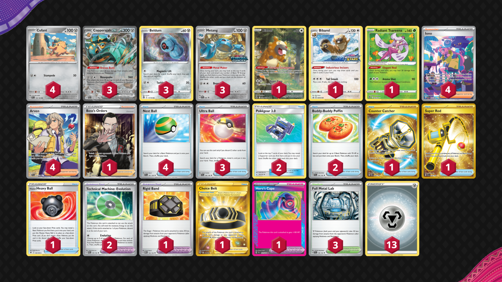

# Copperajah/Metang

Tier **4** | Difficulty: **Moderate** | Gameplan: **Midrange**

**Source**: Azul Garcia Griego - [Twitter post](https://twitter.com/Azul_GG/status/1767960888835977618)

## List
* 1 Bibarel PR-SW 188
* 1 Bidoof CRZ-GG 29
* 1 Radiant Tsareena SIT 16
* 4 Cufant PAL 149
* 3 Beldum SIT 117
* 3 Metang PR-SV 90
* 3 Copperajah ex PAL 150
* 3 Ultra Ball SVI 196
* 2 Pokégear 3.0 UNB 182
* 1 Boss's Orders RCL 189
* 2 Buddy-Buddy Poffin TEF 144
* 1 Rigid Band MEW 165
* 3 Full Metal Lab TEF 148
* 4 Iono PAF 237
* 1 Counter Catcher PAR 264
* 1 Super Rod PAL 276
* 2 Technical Machine: Evolution PAR 178
* 1 Hisuian Heavy Ball ASR 146
* 4 Nest Ball SVI 181
* 1 Choice Belt ASR 211
* 1 Hero's Cape TEF 152
* 4 Arven SVI 235
* 13 Basic {M} Energy Energy 16
