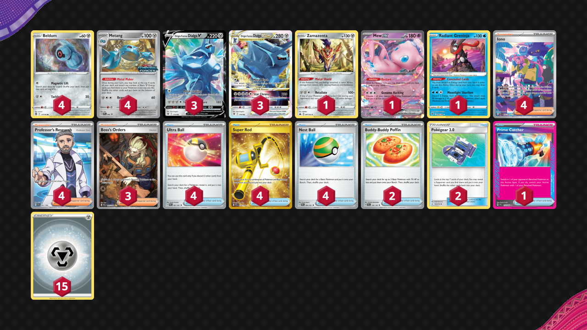

# Dialga/Metang

Tier **2** | Difficulty: **Moderate** | Gameplan: **Midrange**

**Source**: Andrew Hedrick - [1st Place Regional Indianapolis, IN](https://limitlesstcg.com/decks/list/11255)

## List
* 4 Metang PR-SV 90
* 3 Origin Forme Dialga VSTAR ASR 114
* 4 Beldum SIT 117
* 1 Zamazenta CRZ 97 PH
* 1 Mew ex MEW 151
* 3 Origin Forme Dialga V ASR 113
* 1 Radiant Greninja ASR 46
* 4 Ultra Ball PAF 91
* 3 Boss's Orders PAL 265
* 2 Buddy-Buddy Poffin TEF 144
* 4 Super Rod PAL 276
* 4 Iono PAF 237
* 2 Pokégear 3.0 UNB 182
* 4 Professor's Research SVI 241
* 1 Prime Catcher TEF 157
* 4 Nest Ball PAF 84
* 15 Basic {M} Energy Energy 8
