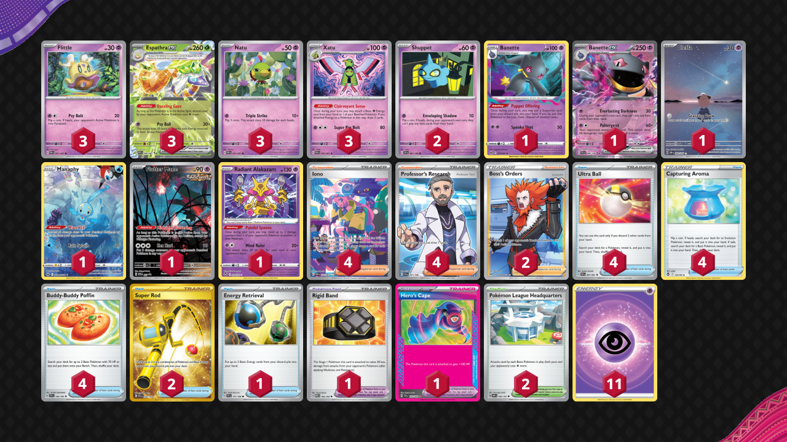

# Espathra/Xatu

Tier **2** | Difficulty: **Moderate+** | Gameplan: **Disruption**

**Source**: Braiden Elfert - [Top 32 EUIC 2024, London](https://limitlesstcg.com/decks/list/10628)

## List
* 1 Banette LOR 73
* 3 Espathra ex PAF 6
* 1 Cleffa OBF 202
* 3 Xatu PAF 26
* 3 Flittle PAF 41
* 1 Manaphy CRZ-GG 6
* 3 Natu PAF 25
* 2 Shuppet SVI 87
* 1 Banette ex SVI 88
* 1 Flutter Mane PR-SV 97
* 1 Radiant Alakazam SIT 59
* 2 Pokémon League Headquarters OBF 192
* 1 Rigid Band MEW 165
* 2 Super Rod PAL 276
* 2 Boss's Orders LOR-TG 24
* 1 Energy Retrieval SVI 171
* 1 Hero's Cape TEF 152
* 4 Ultra Ball PAF 91
* 4 Capturing Aroma SIT 153
* 4 Iono PAF 237
* 4 Professor's Research SVI 241
* 4 Buddy-Buddy Poffin TEF 144
* 11 Basic {P} Energy SVE 5
