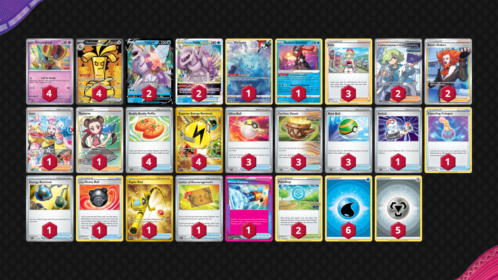

# Gholdengo/Palkia

Tier **2** | Difficulty: **Hard** | Gameplan: **Midrange**

**Source**: たかぴー - [Top 8 City League Tōkyō 03/20](https://limitlesstcg.com/decks/list/jp/6443)

## List
* 1 Manaphy CRZ-GG 6
* 4 Gholdengo ex PAR 252
* 2 Origin Forme Palkia V ASR 39
* 2 Origin Forme Palkia VSTAR ASR 40
* 1 Radiant Greninja ASR 46
* 4 Gimmighoul PAR 87
* 3 Irida ASR 147
* 1 Switch SVI 194
* 3 Ultra Ball PAF 91
* 1 Canceling Cologne ASR 136
* 3 Earthen Vessel PAR 163
* 4 Buddy-Buddy Poffin TEF 144
* 1 Energy Retrieval SVI 171
* 2 Ciphermaniac's Codebreaking TEF 198
* 1 Hisuian Heavy Ball ASR 146
* 1 Super Rod PAL 276
* 4 Superior Energy Retrieval PAL 277
* 1 Iono PAL 269
* 1 Letter of Encouragement OBF 189
* 2 PokéStop PGO 68
* 2 Boss's Orders LOR-TG 24
* 1 Roxanne ASR 188
* 1 Prime Catcher TEF 157
* 3 Nest Ball PAF 84
* 6 Basic {W} Energy SVE 3
* 5 Basic {M} Energy Energy 8
