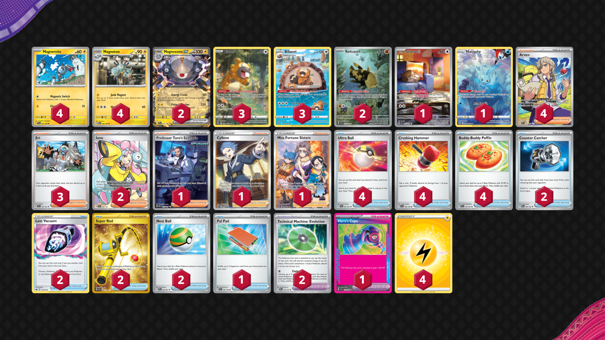

# Magnezone/Relicanth

Tier **4** | Difficulty: **Extreme** | Gameplan: **Control**

**Source**: omochikun - [3rd Place Texas TCG Throwdown Thursdays #4](https://play.limitlesstcg.com/tournament/6614578ebd59c305cfa833ac/player/omochikun/decklist)

## List
* 1 Skwovet SVI 222
* 1 Manaphy CRZ-GG 6
* 2 Relicanth TEF 173
* 3 Bibarel CRZ-GG 25
* 2 Magnezone ex SVI 65
* 4 Magneton MEW 82
* 4 Magnemite SVI 63
* 3 Bidoof CRZ-GG 29
* 4 Arven SVI 235
* 4 Ultra Ball PAF 91
* 4 Crushing Hammer SVI 168
* 3 Eri TEF 146
* 4 Buddy-Buddy Poffin TEF 144
* 2 Counter Catcher PAR 160
* 2 Lost Vacuum CRZ 135
* 2 Super Rod PAL 276
* 1 Professor Turo's Scenario PAR 257
* 1 Cyllene ASR 183
* 1 Miss Fortune Sisters LOR 194
* 2 Technical Machine: Evolution PAR 178
* 1 Hero's Cape TEF 152
* 1 Pal Pad SVI 182
* 2 Iono PAL 254
* 2 Nest Ball PAF 84
* 4 Basic {L} Energy Energy 30
