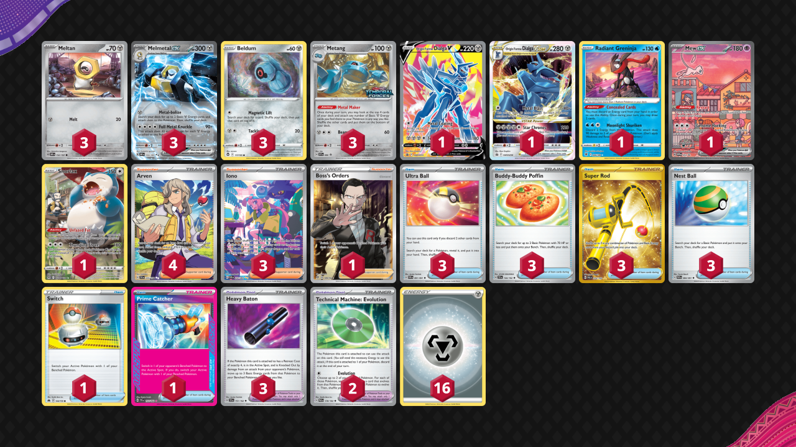

# Melmetal/Metang

Tier **5** | Difficulty: **Easy** | Gameplan: **Accumulate**

**Source**: N/A

## List
* 3 Metang PR-SV 90
* 3 Meltan OBF 152
* 3 Melmetal ex OBF 153
* 3 Beldum SIT 117
* 1 Origin Forme Dialga V PR-SW 255
* 1 Origin Forme Dialga VSTAR PR-SW 256
* 1 Radiant Greninja ASR 46
* 1 Mew ex PR-SV 53
* 1 Snorlax LOR-TG 10
* 1 Switch CRZ 144
* 4 Arven SVI 235
* 3 Ultra Ball PAF 91
* 3 Buddy-Buddy Poffin TEF 144
* 3 Super Rod PAL 276
* 3 Iono PAF 237
* 2 Technical Machine: Evolution PAR 178
* 3 Heavy Baton TEF 151
* 1 Prime Catcher TEF 157
* 3 Nest Ball PAF 84
* 1 Boss's Orders RCL 189
* 16 Basic {M} Energy Energy 16
