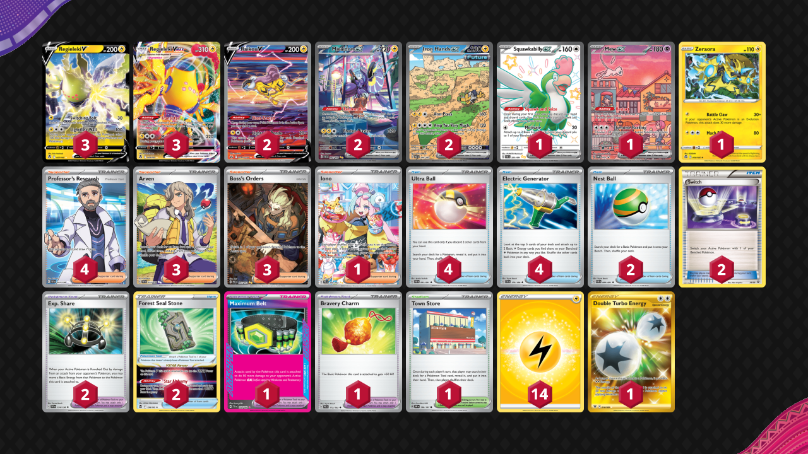

# Miraidon/Regieleki

Tier **4** | Difficulty: **Moderate** | Gameplan: **Midrange**

**Source**: Jesse Parker - TrickyGym discord

## List
* 2 Raikou V CRZ-GG 41
* 2 Miraidon ex SVI 244
* 3 Regieleki VMAX SIT 58
* 1 Squawkabilly ex PAF 223
* 1 Mew ex PR-SV 53
* 3 Regieleki V SIT 57
* 1 Zeraora SIT 56
* 2 Iron Hands ex PAR 248
* 3 Arven SVI 235
* 4 Ultra Ball PAF 91
* 3 Boss's Orders PAL 265
* 2 Exp. Share SVI 174
* 4 Electric Generator SVI 170
* 1 Iono PAL 269
* 1 Town Store OBF 196
* 4 Professor's Research SVI 241
* 1 Maximum Belt TEF 154
* 2 Forest Seal Stone SIT 156
* 2 Nest Ball PAF 84
* 1 Bravery Charm PAL 173
* 2 Switch KSS 38
* 1 Double Turbo Energy ASR 216
* 14 Basic {L} Energy SVE 4
