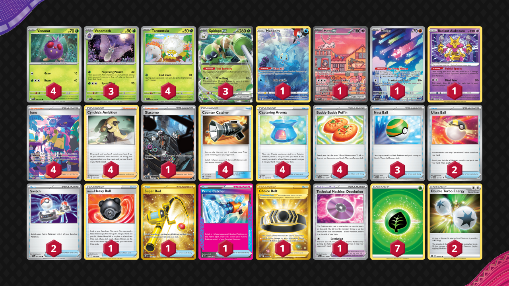

# Spidops/Venomoth

Tier **4** | Difficulty: **Moderate** | Gameplan: **Stall**

**Source**: ナカミ - [2nd Place City League Nara 02/14](https://limitlesstcg.com/decks/list/jp/1883)

## List
* 3 Spidops ex SVI 19
* 4 Venonat MEW 48
* 1 Manaphy CRZ-GG 6
* 3 Venomoth MEW 49
* 4 Tarountula PAL 16
* 1 Mew ex PR-SV 53
* 1 Minior PAR 201
* 1 Radiant Alakazam SIT 59
* 1 Hisuian Heavy Ball ASR 146
* 1 Super Rod PAL 276
* 3 Nest Ball PAF 84
* 4 Counter Catcher CIN 91
* 2 Ultra Ball PAF 91
* 1 Choice Belt ASR 211
* 1 Prime Catcher TEF 157
* 4 Capturing Aroma SIT 153
* 4 Iono PAF 237
* 1 Giacomo PAL 267
* 1 Technical Machine: Devolution PAR 177
* 4 Cynthia's Ambition BRS 138
* 4 Buddy-Buddy Poffin TEF 144
* 2 Switch SVI 194
* 7 Basic {G} Energy SVE 1
* 2 Double Turbo Energy BRS 151
