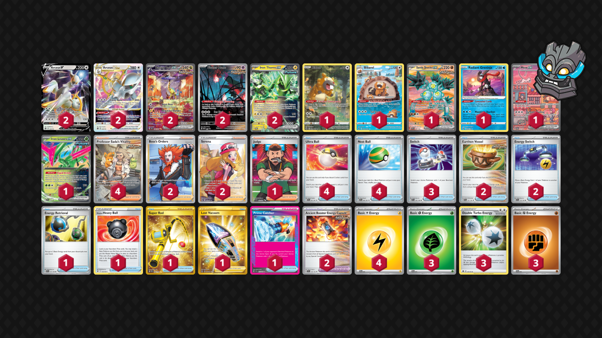

# Arceus/Paradox

Tier **5** | Difficulty: **Moderate** | Gameplan: **Disruption Midrange**

**Source**: しの@9合目 - [Top 8 City League Chiba 04/21](https://limitlesstcg.com/decks/list/jp/8731)

## List
* 2 Arceus VSTAR BRS 123
* 2 Arceus V BRS 122
* 2 Raging Bolt ex TEF 208
* 1 Sandy Shocks ex PAR 228
* 1 Bibarel CRZ-GG 25
* 2 Flutter Mane PR-SV 97
* 1 Radiant Greninja ASR 46
* 1 Mew ex PR-SV 53
* 1 Iron Leaves ex PR-SV 128
* 2 Iron Thorns ex TWM 77
* 1 Bidoof CRZ-GG 29
* 3 Switch SVI 194
* 4 Ultra Ball PAF 91
* 2 Earthen Vessel PAR 163
* 2 Energy Switch SVI 173
* 2 Ancient Booster Energy Capsule TEF 140
* 1 Energy Retrieval SVI 171
* 1 Hisuian Heavy Ball ASR 146
* 1 Super Rod PAL 276
* 4 Professor Sada's Vitality PAR 256
* 2 Boss's Orders LOR-TG 24
* 1 Lost Vacuum LOR 217
* 2 Serena SIT 193
* 1 Prime Catcher TEF 157
* 4 Nest Ball PAF 84
* 1 Judge PAF 228
* 3 Basic {G} Energy SVE 1
* 3 Double Turbo Energy BRS 151
* 4 Basic {L} Energy SVE 4
* 3 Basic {F} Energy SVE 6
