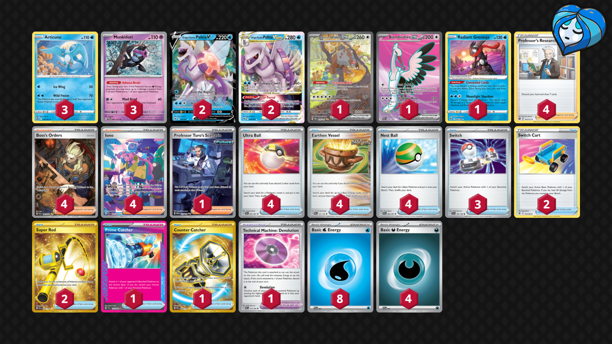

# Articuno/Munkidori

Tier **F** | Difficulty: **Hard** | Gameplan: **Combo Stall**

**Source**: ハイパーウサギ - [Top 16 City League Ehime 05/06](https://limitlesstcg.com/decks/list/jp/11146)

## List
* 3 Articuno SIT 36
* 1 Bloodmoon Ursaluna ex TWM 216
* 3 Munkidori TWM 95
* 1 Bombirdier ex PAR 234
* 2 Origin Forme Palkia V ASR 39
* 2 Origin Forme Palkia VSTAR ASR 40
* 1 Radiant Greninja ASR 46
* 4 Professor's Research BRS 147
* 3 Switch SVI 194
* 2 Switch Cart ASR 154
* 4 Ultra Ball PAF 91
* 4 Boss's Orders PAL 265
* 4 Earthen Vessel PAR 163
* 4 Iono PAF 237
* 2 Super Rod PAL 276
* 1 Professor Turo's Scenario PAR 257
* 1 Technical Machine: Devolution PAR 177
* 1 Prime Catcher TEF 157
* 1 Counter Catcher PAR 264
* 4 Nest Ball PAF 84
* 8 Basic {W} Energy SVE 3
* 4 Basic {D} Energy SVE 7
