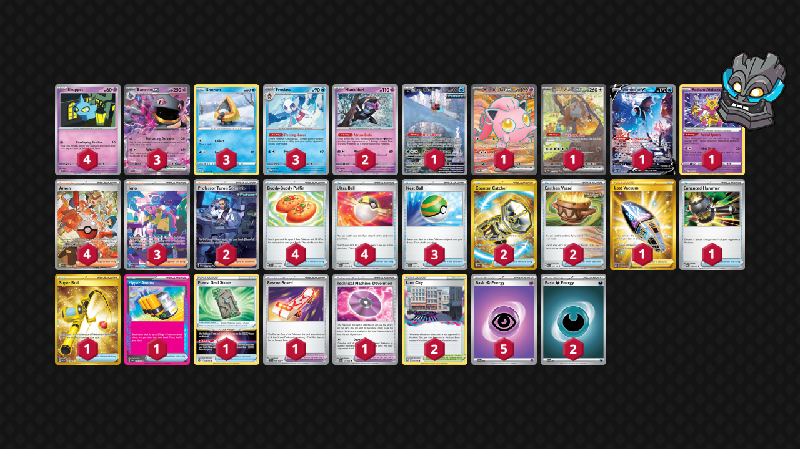

# Banette/Froslass

Tier **4** | Difficulty: **Hard** | Gameplan: **Disruption**

**Source**: Todtebyn3 - TrickyGym discord

## List
* 2 Munkidori TWM 95
* 1 Iron Bundle PR-SV 66
* 3 Snorunt SIT 41
* 4 Shuppet SVI 87 PH
* 1 Scream Tail ex TWM 197
* 1 Bloodmoon Ursaluna ex TWM 216
* 3 Froslass TWM 53
* 1 Lumineon V BRS 156
* 3 Banette ex SVI 88
* 1 Radiant Alakazam SIT 59
* 1 Lost Vacuum LOR 217
* 1 Enhanced Hammer TWM 148
* 1 Super Rod PAL 276
* 1 Forest Seal Stone SIT 156
* 2 Professor Turo's Scenario PAR 257
* 1 Rescue Board TEF 159
* 3 Nest Ball SVI 181
* 2 Lost City LOR 161
* 4 Arven PAF 235
* 3 Iono PAF 237
* 1 Hyper Aroma TWM 152
* 1 Technical Machine: Devolution PAR 177
* 2 Counter Catcher PAR 264
* 4 Buddy-Buddy Poffin TEF 144
* 4 Ultra Ball SVI 196
* 2 Earthen Vessel PAR 163
* 5 Basic {P} Energy SVE 5
* 2 Basic {D} Energy SVE 7
