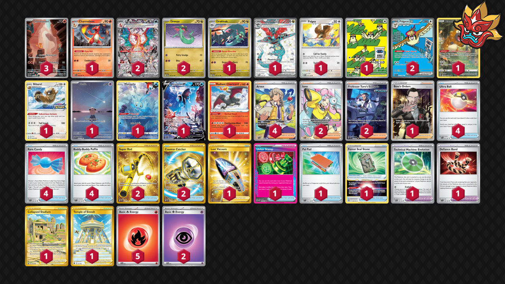

# Charizard/Dragapult/Pidgeot

Tier **2** | Difficulty: **Extreme** | Gameplan: **Accumulate**

**Source**: Tord Reklev - [Top 32 NAIC 2024, New Orleans](https://limitlesstcg.com/decks/list/11931)

## List
* 1 Pidgey MEW 16
* 1 Pidgey OBF 207
* 1 Cleffa OBF 202
* 2 Pidgeot ex OBF 225
* 1 Bidoof CRZ-GG 29
* 2 Charizard ex OBF 223
* 1 Bibarel PR-SW 188
* 1 Charmeleon PAF 8
* 3 Charmander MEW 168
* 1 Drakloak TWM 129
* 1 Manaphy CRZ-GG 6
* 2 Dreepy TWM 128
* 1 Lumineon V BRS 156
* 1 Radiant Charizard CRZ 20
* 1 Dragapult ex TWM 200
* 1 Boss's Orders RCL 189
* 1 Collapsed Stadium LOR 215
* 1 Lost Vacuum LOR 217
* 2 Iono PAL 254
* 1 Temple of Sinnoh ASR 214
* 1 Unfair Stamp TWM 165
* 2 Super Rod PAL 276
* 1 Forest Seal Stone SIT 156
* 2 Professor Turo's Scenario PAR 257
* 4 Ultra Ball PAF 91
* 1 Pal Pad SVI 182
* 1 Technical Machine: Evolution PAR 178
* 4 Arven SVI 235
* 1 Defiance Band SVI 169
* 4 Rare Candy PAF 89
* 2 Counter Catcher PAR 264
* 4 Buddy-Buddy Poffin TEF 144
* 5 Basic {R} Energy SVE 2
* 2 Basic {P} Energy SVE 5
