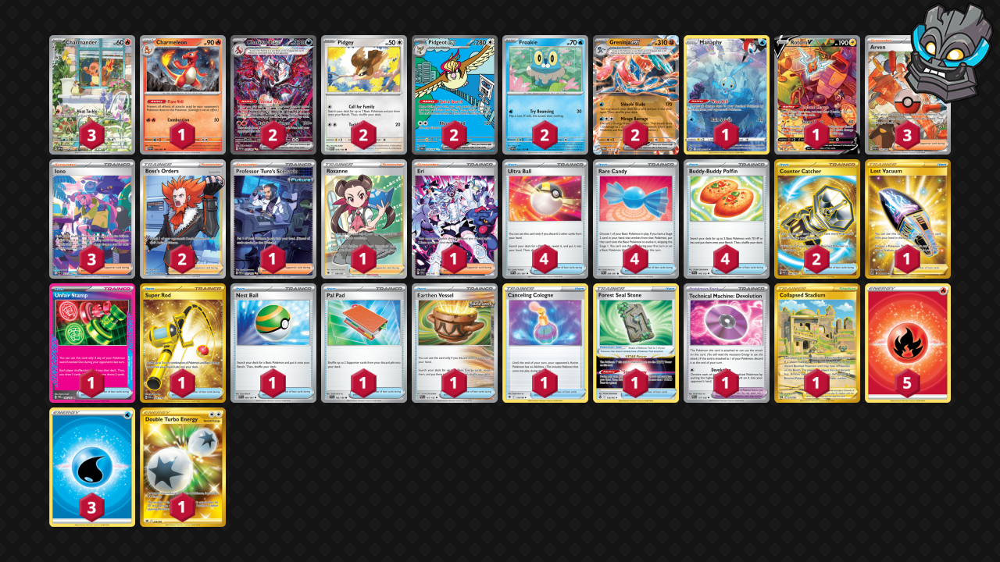

# Charizard/Greninja/Pidgeot

Tier **4** | Difficulty: **Hard** | Gameplan: **Midrange Accumulate**

**Source**: Andrew Mahone - TrickyGym discord

## List
* 2 Pidgey MEW 16
* 2 Pidgeot ex OBF 225
* 1 Charmeleon PAF 8
* 2 Greninja ex TWM 106
* 2 Froakie OBF 56
* 1 Manaphy CRZ-GG 6
* 3 Charmander PR-SV 44
* 2 Charizard ex PAF 234
* 1 Rotom V LOR 177
* 1 Collapsed Stadium LOR 215
* 1 Lost Vacuum LOR 217
* 1 Unfair Stamp TWM 165
* 1 Super Rod PAL 276
* 1 Nest Ball PAF 84
* 1 Forest Seal Stone SIT 156
* 1 Professor Turo's Scenario PAR 257
* 2 Boss's Orders LOR-TG 24
* 1 Roxanne ASR 188
* 4 Ultra Ball PAF 91
* 1 Pal Pad SVI 182
* 3 Arven PAF 235
* 3 Iono PAF 237
* 1 Technical Machine: Devolution PAR 177
* 1 Earthen Vessel PAR 163 PH
* 2 Counter Catcher PAR 264
* 4 Rare Candy PAF 89
* 1 Eri TEF 210
* 4 Buddy-Buddy Poffin TEF 144
* 1 Canceling Cologne ASR 136
* 1 Double Turbo Energy ASR 216
* 3 Basic {W} Energy Energy 47
* 5 Basic {R} Energy Energy 46
