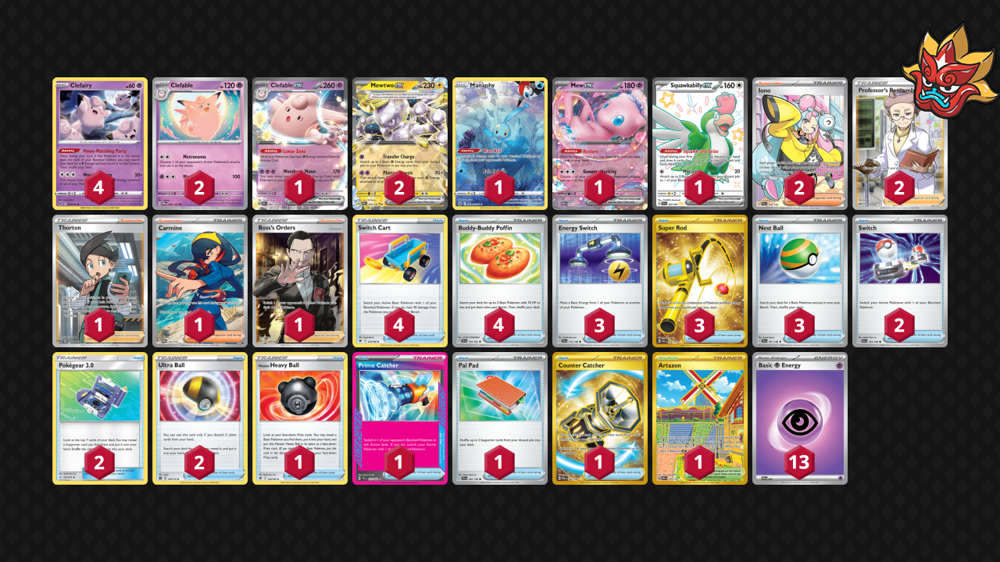

# Clefable/Mewtwo

Tier **5** | Difficulty: **Moderate** | Gameplan: **Turbo**

**Source**: Prowlerrs - TrickyGym discord

## List
* 1 Manaphy CRZ-GG 6
* 2 Mewtwo ex PAR 58
* 1 Mew ex MEW 151
* 4 Clefairy LOR 62
* 1 Clefable ex OBF 82
* 1 Squawkabilly ex PAF 223
* 2 Clefable TWM 79
* 2 Switch SVI 194
* 4 Switch Cart ASR 154
* 3 Energy Switch SVI 173
* 4 Buddy-Buddy Poffin TEF 144
* 1 Hisuian Heavy Ball ASR 146
* 3 Super Rod PAL 276
* 2 Pokégear 3.0 UNB 182
* 1 Artazon OBF 229
* 1 Thorton LOR 195
* 2 Ultra Ball BRS 150
* 1 Prime Catcher TEF 157
* 1 Pal Pad SVI 182
* 2 Iono PAL 254
* 3 Nest Ball SVI 181
* 1 Counter Catcher PAR 264
* 1 Carmine TWM 204
* 1 Boss's Orders RCL 189
* 2 Professor's Research SSH 201
* 13 Basic {P} Energy SVE 5
