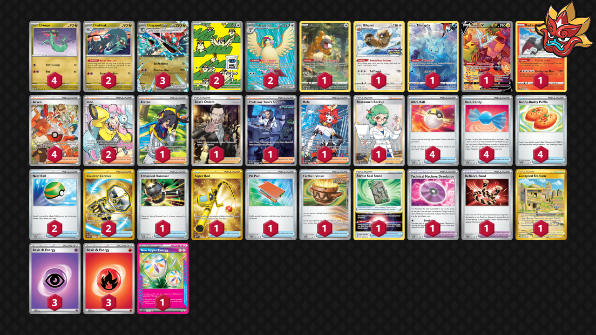

# Dragapult/Pidgeot

Tier **2** | Difficulty: **Hard** | Gameplan: **Accumulate Spread**

**Source**: Chaz Finchum - [Top 32 NAIC 2024, New Orleans](https://limitlesstcg.com/decks/list/11935)

## List
* 2 Pidgey OBF 207
* 1 Bidoof CRZ-GG 29
* 1 Bibarel PR-SW 188
* 2 Drakloak TWM 129
* 1 Manaphy CRZ-GG 6
* 4 Dreepy TWM 128
* 1 Rotom V LOR 177
* 2 Pidgeot ex OBF 217
* 1 Radiant Charizard CRZ 20
* 3 Dragapult ex TWM 130
* 1 Kieran TWM 206
* 1 Boss's Orders RCL 189
* 1 Collapsed Stadium LOR 215
* 2 Iono PAL 254
* 1 Enhanced Hammer TWM 148
* 1 Super Rod PAL 276
* 2 Nest Ball PAF 84
* 1 Forest Seal Stone SIT 156
* 1 Professor Turo's Scenario PAR 257
* 4 Ultra Ball PAF 91
* 1 Pal Pad SVI 182
* 4 Arven PAF 235
* 1 Mela PAR 236
* 1 Technical Machine: Devolution PAR 177
* 1 Roseanne's Backup BRS 172
* 1 Earthen Vessel PAR 163
* 1 Defiance Band SVI 169
* 2 Counter Catcher PAR 264
* 4 Rare Candy PAF 89
* 4 Buddy-Buddy Poffin TEF 144
* 3 Basic {P} Energy SVE 5
* 3 Basic {R} Energy SVE 2
* 1 Neo Upper Energy TEF 162
