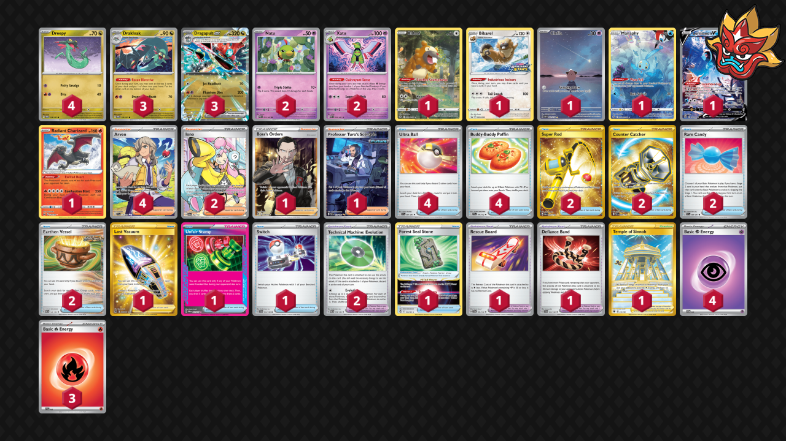

# Dragapult/Xatu

Tier **3** | Difficulty: **Hard** | Gameplan: **Accumulate Spread**

**Source**: Gabriel Kuchera - [Day 2 NAIC 2024, New Orleans](https://limitlesstcg.com/decks/list/11939)

## List
* 1 Cleffa OBF 202
* 1 Bidoof CRZ-GG 29
* 2 Xatu PAF 26
* 1 Bibarel PR-SW 188
* 3 Drakloak TWM 129
* 1 Manaphy CRZ-GG 6
* 4 Dreepy TWM 128
* 2 Natu PAF 25
* 1 Lumineon V BRS 156
* 1 Radiant Charizard CRZ 20
* 3 Dragapult ex TWM 130
* 1 Boss's Orders RCL 189
* 1 Lost Vacuum LOR 217
* 2 Iono PAL 254
* 1 Temple of Sinnoh ASR 214
* 1 Unfair Stamp TWM 165
* 2 Super Rod PAL 276
* 1 Forest Seal Stone SIT 156
* 1 Professor Turo's Scenario PAR 257
* 4 Ultra Ball PAF 91
* 1 Rescue Board TEF 159
* 2 Technical Machine: Evolution PAR 178
* 4 Arven SVI 235
* 1 Defiance Band SVI 169
* 2 Counter Catcher PAR 264
* 2 Rare Candy PAF 89
* 4 Buddy-Buddy Poffin TEF 144
* 1 Switch SVI 194
* 2 Earthen Vessel PAR 163
* 4 Basic {P} Energy SVE 5
* 3 Basic {R} Energy SVE 2
