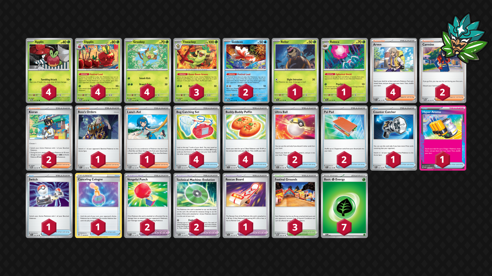
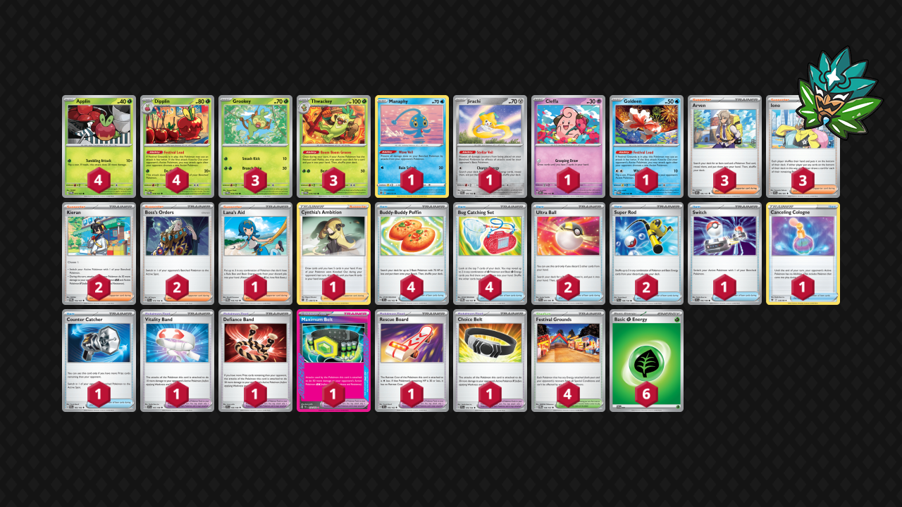

# Festival Lead

* [Hyper Aroma](#hyper-aroma)
* [Maximum Belt](#maximum-belt)

## Hyper Aroma

Tier **5** | Difficulty: **Moderate** | Gameplan: **Midrange**

**Source**: Dom Ritchie - [Twitter post](https://x.com/TempoPTCG/status/1794525445607587882)

[top](#festival-lead)

### List
* 3 Thwackey TWM 15
* 4 Applin TWM 17
* 4 Dipplin TWM 18
* 1 Rabsca TEF 24 PH
* 4 Grookey TWM 14
* 2 Goldeen TWM 44
* 1 Rellor TEF 23
* 1 Counter Catcher PAR 160
* 2 Vengeful Punch OBF 197
* 4 Bug Catching Set TWM 143
* 2 Carmine TWM 145
* 3 Festival Grounds TWM 149
* 2 Ultra Ball PAF 91
* 1 Rescue Board TEF 159
* 2 Pal Pad SVI 182
* 4 Arven OBF 186
* 1 Boss's Orders PAL 172
* 1 Hyper Aroma TWM 152
* 1 Lana's Aid TWM 155
* 2 Kieran TWM 154
* 2 Technical Machine: Evolution PAR 178
* 4 Buddy-Buddy Poffin TEF 144
* 1 Switch SVI 194
* 1 Canceling Cologne ASR 136
* 7 Basic {G} Energy SVE 1

## Maximum Belt

Tier **5** | Difficulty: **Moderate** | Gameplan: **Midrange**

**Source**: ブロッコリーを許すな - [4th Place City League Hokkaido 04/27](https://limitlesstcg.com/decks/list/jp/9639)

[top](#festival-lead)

### List
* 3 Thwackey TWM 15
* 4 Dipplin TWM 18
* 1 Manaphy BRS 41
* 1 Jirachi PAR 126
* 3 Grookey TWM 14
* 1 Cleffa OBF 80
* 1 Goldeen TWM 44
* 4 Applin TWM 17
* 1 Vitality Band SVI 197
* 1 Switch SVI 194
* 2 Ultra Ball PAF 91
* 1 Canceling Cologne ASR 136
* 3 Arven OBF 186
* 1 Defiance Band SVI 169
* 4 Buddy-Buddy Poffin TEF 144
* 1 Counter Catcher PAR 160
* 1 Lana's Aid TWM 155
* 2 Kieran TWM 154
* 2 Super Rod PAL 188
* 3 Iono PAF 80
* 1 Maximum Belt TEF 154
* 1 Rescue Board TEF 159
* 1 Cynthia's Ambition BRS 138
* 4 Bug Catching Set TWM 143
* 1 Choice Belt PAL 176
* 2 Boss's Orders PAL 172
* 4 Festival Grounds TWM 149
* 6 Basic {G} Energy SVE 1
