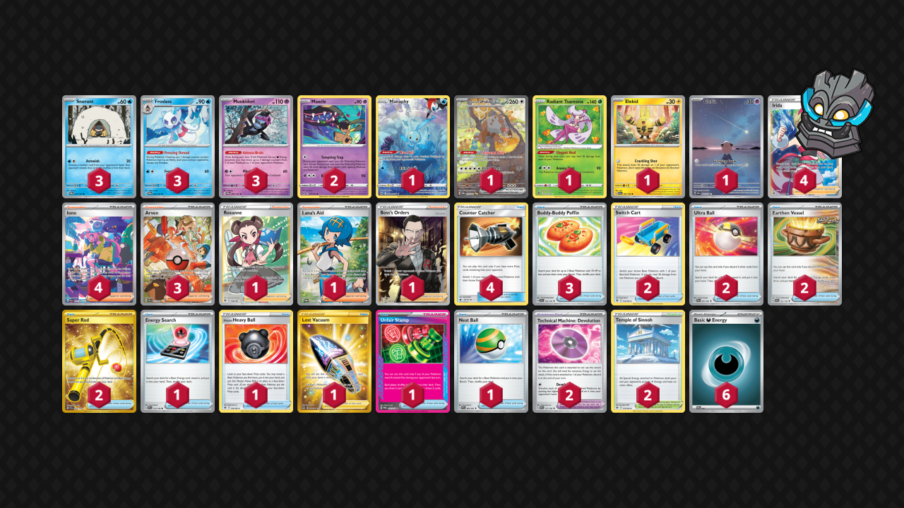

# Froslass/Munkidori

Tier **4** | Difficulty: **Hard** | Gameplan: **Spread**

**Source**: Rivalx92 - [Top 8 PokeDeck On-line #56](https://play.limitlesstcg.com/tournament/6653ccc877321005b44fe0f4/player/rivalx92/decklist)

## List
* 1 Manaphy CRZ-GG 6
* 2 Mawile LOR 71
* 1 Bloodmoon Ursaluna ex TWM 216
* 3 Munkidori TWM 95
* 3 Froslass TWM 53
* 1 Radiant Tsareena SIT 16
* 1 Elekid PAR 59 PH
* 1 Cleffa OBF 202
* 3 Snorunt TWM 51
* 4 Irida ASR 186
* 2 Switch Cart ASR 154
* 2 Ultra Ball PAF 91
* 1 Energy Search SVI 172
* 2 Earthen Vessel PAR 163
* 3 Buddy-Buddy Poffin TEF 144
* 1 Hisuian Heavy Ball ASR 146
* 3 Arven PAF 235
* 2 Super Rod PAL 276
* 4 Iono PAF 237
* 2 Technical Machine: Devolution PAR 177
* 4 Counter Catcher CIN 91
* 1 Roxanne ASR 188
* 1 Lost Vacuum LOR 217
* 2 Temple of Sinnoh ASR 155
* 1 Unfair Stamp TWM 165
* 1 Nest Ball PAF 84
* 1 Lana's Aid TWM 207
* 1 Boss's Orders RCL 189
* 6 Basic {D} Energy SVE 7
