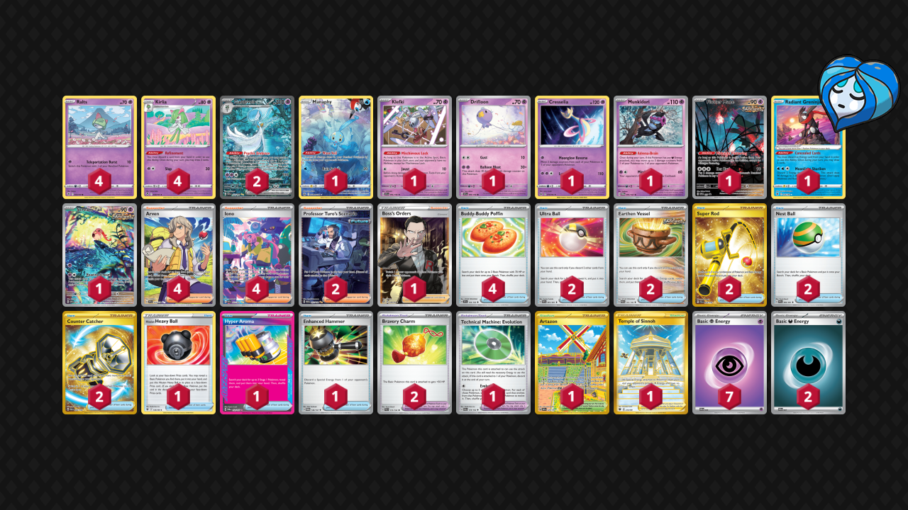
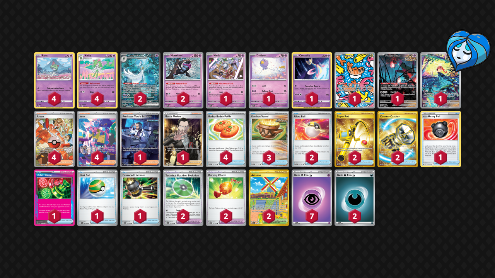

# Gardevoir ex

* [Hyper Aroma](#hyper-aroma)
* [Unfair Stamp](#unfair-stamp)

## Hyper Aroma

Tier **1** | Difficulty: **Extreme** | Gameplan: **Accumulate Toolbox**

**Source**: Stéphane Ivanoff - [2nd Place NAIC 2024, New Orleans](https://limitlesstcg.com/decks/list/11921)

[top](#gardevoir-ex)

### List
* 1 Manaphy CRZ-GG 6
* 1 Klefki SVI 96
* 4 Kirlia SIT 68
* 1 Drifloon SVI 89
* 1 Cresselia LOR 74
* 1 Munkidori TWM 95
* 2 Gardevoir ex PAF 233
* 1 Flutter Mane PR-SV 97
* 1 Radiant Greninja ASR 46
* 4 Ralts ASR 60
* 1 Scream Tail PR-SV 65
* 4 Arven SVI 235
* 2 Ultra Ball PAF 91
* 2 Earthen Vessel PAR 163
* 4 Buddy-Buddy Poffin TEF 144
* 1 Hisuian Heavy Ball ASR 146
* 4 Iono PAF 237
* 2 Super Rod PAL 276
* 1 Hyper Aroma TWM 152
* 2 Professor Turo's Scenario PAR 257
* 1 Technical Machine: Evolution PAR 178
* 1 Artazon OBF 229
* 1 Temple of Sinnoh ASR 214
* 2 Nest Ball PAF 84
* 2 Counter Catcher PAR 264
* 1 Boss's Orders RCL 189
* 2 Bravery Charm PAL 173
* 1 Enhanced Hammer TWM 148
* 7 Basic {P} Energy SVE 5
* 2 Basic {D} Energy SVE 7

## Unfair Stamp

Tier **1** | Difficulty: **Extreme** | Gameplan: **Accumulate Toolbox**

**Source**: Keito Arai - [3rd Place NAIC 2024, New Orleans](https://limitlesstcg.com/decks/list/11916)

[top](#gardevoir-ex)

### List
* 1 Klefki SVI 96
* 4 Kirlia SIT 68
* 1 Drifloon SVI 89
* 1 Cresselia LOR 74
* 2 Munkidori TWM 95
* 2 Gardevoir ex PAF 233
* 1 Tatsugiri TWM 186
* 1 Flutter Mane PR-SV 97
* 4 Ralts ASR 60
* 1 Scream Tail PR-SV 65
* 2 Ultra Ball PAF 91
* 3 Earthen Vessel PAR 163
* 4 Buddy-Buddy Poffin TEF 144
* 1 Hisuian Heavy Ball ASR 146
* 4 Arven PAF 235
* 2 Super Rod PAL 276
* 4 Iono PAF 237
* 1 Professor Turo's Scenario PAR 257
* 2 Technical Machine: Evolution PAR 178
* 2 Artazon OBF 229
* 1 Unfair Stamp TWM 165
* 1 Nest Ball PAF 84
* 2 Counter Catcher PAR 264
* 1 Boss's Orders RCL 189
* 2 Bravery Charm PAL 173
* 1 Enhanced Hammer TWM 148
* 7 Basic {P} Energy SVE 5
* 2 Basic {D} Energy SVE 7
