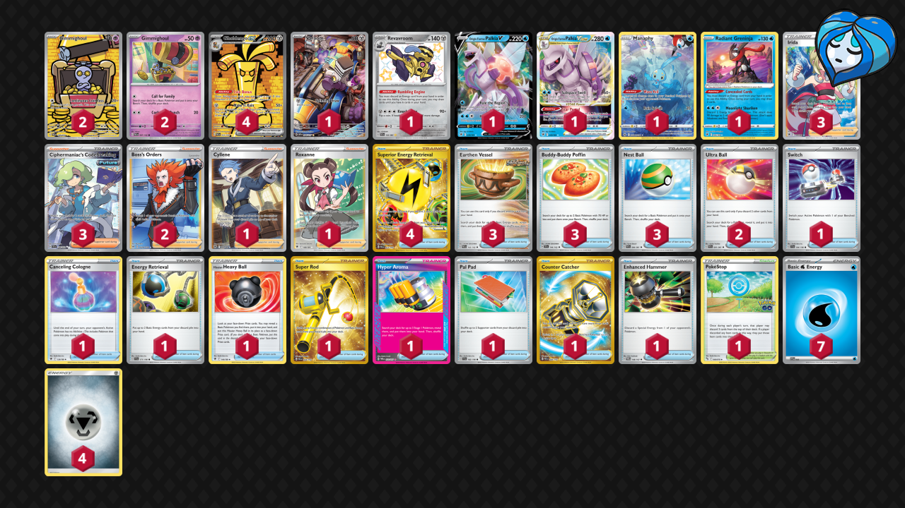

# Gholdengo/Palkia

Tier **3** | Difficulty: **Hard** | Gameplan: **Midrange**

**Source**: Pedro Hernandez - [Day 2 NAIC 2024, New Orleans](https://limitlesstcg.com/decks/list/11985)

## List
* 1 Manaphy CRZ-GG 6
* 1 Revavroom PAF 193
* 4 Gholdengo ex PAR 252
* 2 Gimmighoul PAR 198
* 1 Varoom OBF 206
* 1 Origin Forme Palkia V ASR 39
* 1 Origin Forme Palkia VSTAR ASR 40
* 1 Radiant Greninja ASR 46
* 2 Gimmighoul PAR 87
* 1 Switch SVI 194
* 3 Irida ASR 186
* 2 Ultra Ball PAF 91
* 1 Canceling Cologne ASR 136
* 3 Earthen Vessel PAR 163
* 3 Buddy-Buddy Poffin TEF 144
* 1 Energy Retrieval SVI 171
* 3 Ciphermaniac's Codebreaking TEF 198
* 1 Hisuian Heavy Ball ASR 146
* 1 Super Rod PAL 276
* 4 Superior Energy Retrieval PAL 277
* 1 Hyper Aroma TWM 152
* 1 PokéStop PGO 68
* 1 Cyllene ASR 183
* 2 Boss's Orders LOR-TG 24
* 1 Roxanne ASR 188
* 1 Pal Pad SVI 182
* 1 Counter Catcher PAR 264
* 3 Nest Ball PAF 84
* 1 Enhanced Hammer TWM 148
* 7 Basic {W} Energy SVE 3
* 4 Basic {M} Energy Energy 8
