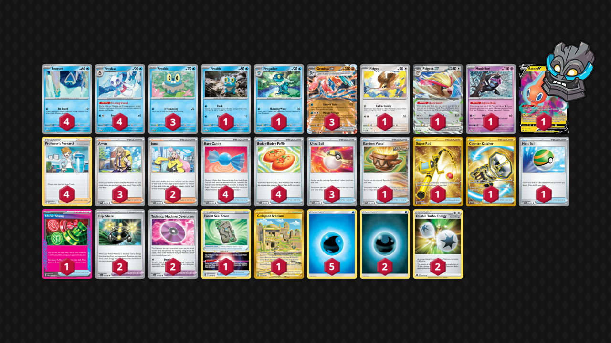

# Greninja/Froslass

Tier **3** | Difficulty: **Hard** | Gameplan: **Spread**

**Source**: Zach Elliott - [Day 2 NAIC 2024, New Orleans](https://limitlesstcg.com/decks/list/12024)

## List
* 1 Munkidori TWM 95
* 4 Froslass TWM 53
* 3 Greninja ex TWM 106
* 1 Pidgeot ex OBF 164
* 1 Froakie TWM 56
* 4 Snorunt PAR 37
* 1 Rotom V CRZ 45
* 1 Frogadier TWM 57
* 1 Pidgey MEW 16
* 3 Froakie OBF 56
* 4 Rare Candy PAF 89
* 3 Ultra Ball PAF 91
* 2 Exp. Share SVI 174
* 3 Arven OBF 186
* 1 Earthen Vessel PAR 163
* 4 Buddy-Buddy Poffin TEF 144
* 1 Super Rod PAL 276
* 4 Professor's Research SHF 60
* 2 Technical Machine: Devolution PAR 177
* 2 Iono PAF 80
* 1 Forest Seal Stone SIT 156
* 1 Collapsed Stadium LOR 215
* 1 Counter Catcher PAR 264
* 1 Nest Ball PAF 84
* 1 Unfair Stamp TWM 165
* 2 Basic {D} Energy Energy 7
* 5 Basic {W} Energy Energy 3
* 2 Double Turbo Energy BRS 151
